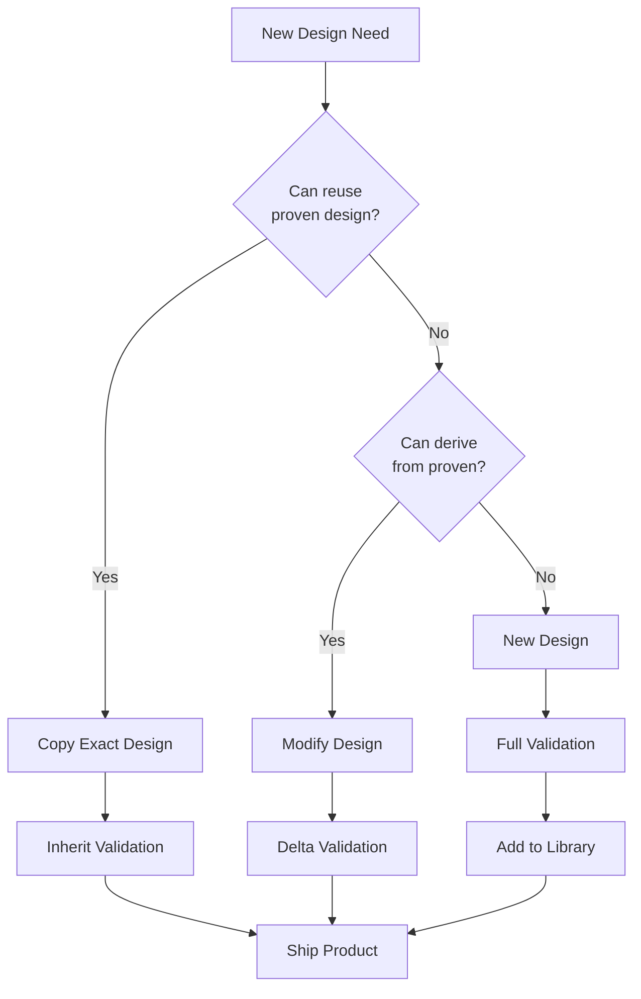

# Proven Design Reuse Strategy
## Balancing Reuse with Change Management

### Core Principle: "Reuse When You Can, Change When You Must"

## 1. Versioned Reference Designs

### The Library of Proven Designs

```bhdl
// Not theoretical "platforms" but ACTUAL proven designs
proven_designs {
    
    reference_design SoC_Core_Power_v1 {
        // This EXACT design is in production
        metadata {
            first_used: "ADAS_ECU_Gen1";
            production_since: "2019-03";
            units_shipped: 1_500_000;
            field_failures: 3;  // Excellent track record
            asil_certified: ASIL_D;
        }
        
        implementation {
            regulator: TPS54360;
            configuration: "0.85V @ 15A";
            
            // Exact BOM
            bom: [
                "TPS54360RTAR - TI",
                "744325100 - Wurth 10µH inductor",
                "C3216X5R0J476M - TDK 47µF capacitor",
                // ... complete BOM
            ];
            
            // Proven schematic
            schematic: "ref_designs/soc_core_v1.sch";
            
            // Validated layout
            layout: "ref_designs/soc_core_v1.pcb";
        }
        
        safety_validation {
            fmea: "completed 2019-01-15";
            test_report: "TR-2019-0142";
            
            achieved_metrics {
                spfm: 94.2%;
                lfm: 72.1%;
                pmhf: 8.3FIT;
            }
        }
        
        reuse_checklist {
            // What must be true to reuse this
            conditions: [
                "Input voltage: 5V ± 10%",
                "Output: 0.85V ± 2%",
                "Load: 0-15A with 5A/µs slew",
                "Ambient: -40°C to 85°C"
            ];
            
            // If these match, you can copy it exactly!
        }
    }
    
    reference_design SoC_Core_Power_v2 {
        // Version 2: When TPS54360 became unavailable
        metadata {
            derived_from: "SoC_Core_Power_v1";
            reason_for_change: "TPS54360 end-of-life";
            change_date: "2024-01-15";
            validation_status: "In progress";
        }
        
        implementation {
            regulator: RT6150A;  // Pin-compatible alternative
            configuration: "0.85V @ 15A";
            
            changes_from_v1: [
                "U1: TPS54360 → RT6150A",
                "R12: 10kΩ → 12kΩ (compensation adjustment)",
                "C8: 22nF → 27nF (loop stability)"
            ];
        }
        
        safety_revalidation {
            // What needs re-analysis
            full_reanalysis: [
                "Thermal behavior (different efficiency)",
                "Transient response (different control)",
                "EMC (different switching edge rates)"
            ];
            
            can_reuse: [
                "PCB layout (pin compatible)",
                "Test procedures (same functions)",
                "Software interfaces (same signals)"
            ];
        }
    }
}
```

## 2. Design Reuse Process

### For Board Designers

```bhdl
board New_ECU_Design {
    
    // Step 1: Check if you can reuse proven design
    soc_power: reuse_decision {
        requirement: "0.85V @ 12A for SoC";
        
        check_library: proven_designs.SoC_Core_Power_v1;
        
        compatibility_check {
            ✓ voltage: 0.85V matches;
            ✓ current: 12A < 15A capacity;
            ✓ temperature: -40°C to 85°C matches;
            ✓ input: 5V available;
        }
        
        decision: "REUSE - All conditions met!";
    }
    
    // Step 2: Import the proven design
    import proven_designs.SoC_Core_Power_v1 as soc_power {
        // Use EXACT same implementation
        copy_schematic: true;
        copy_layout: true;
        copy_bom: true;
    }
    
    // Step 3: Inherit safety validation
    safety_credit {
        inherits: SoC_Core_Power_v1.safety_validation;
        
        additional_validation: "None needed - exact reuse";
        
        // 6 months of validation work avoided!
    }
}
```

### When Changes Are Needed

```bhdl
board Another_ECU_Design {
    
    // Step 1: Try to reuse
    soc_power: reuse_decision {
        requirement: "0.85V @ 20A for bigger SoC";
        
        check_library: proven_designs.SoC_Core_Power_v1;
        
        compatibility_check {
            ✓ voltage: 0.85V matches;
            ✗ current: 20A > 15A capacity;  // Can't reuse!
        }
        
        decision: "MODIFY - Current too high";
    }
    
    // Step 2: Create derivative design
    soc_power: derive_from proven_designs.SoC_Core_Power_v1 {
        changes {
            // Keep what works
            keep: [topology, control_scheme, protection];
            
            // Change what must change
            modify: {
                regulator: "TPS543B20 (25A capable)";
                inductor: "Lower DCR for higher current";
                capacitors: "More output caps";
            }
        }
    }
    
    // Step 3: Delta validation
    safety_validation {
        reuse_from_v1: [
            "Basic failure modes",
            "Protection concepts",
            "Test procedures"
        ];
        
        new_analysis_needed: [
            "Thermal at 20A",
            "Stability with new compensation",
            "Current limit behavior"
        ];
        
        // Maybe 2 months work instead of 6
    }
}
```

## 3. Change Management Process

### Tracking What Can Be Reused

```bhdl
change_impact_matrix {
    
    // Component substitution (same function)
    component_swap: {
        change: "TPS54360 → RT6150A";
        
        can_reuse: [
            ✓ "PCB footprint (pin compatible)",
            ✓ "Basic schematic topology",
            ✓ "Design requirements",
            ✓ "Test setup"
        ];
        
        must_revalidate: [
            ✗ "Thermal analysis",
            ✗ "EMC testing",
            ✗ "Transient response",
            ✗ "Efficiency curves"
        ];
        
        estimated_impact: "30% of original validation effort";
    }
    
    // Topology change (different approach)
    topology_change: {
        change: "Buck → Buck-boost";
        
        can_reuse: [
            ✓ "Requirements",
            ✓ "Test procedures (modified)",
            ✓ "Safety concepts"
        ];
        
        must_revalidate: [
            ✗ "Everything else"
        ];
        
        estimated_impact: "80% of original effort";
    }
}
```

## 4. The Practical Workflow



## 5. BHDL Support for Reuse

### Version Control Integration

```bhdl
proven_design SoC_Power {
    version: 1.2.3;
    
    history {
        v1.0.0: "Initial design - TPS54360";
        v1.1.0: "Added EMC filtering";
        v1.2.0: "Improved thermal design";
        v2.0.0: "RT6150A substitution";
    }
    
    compatibility {
        v1.x: "All v1 versions are pin-compatible";
        v2.x: "v2 requires board respin";
    }
}
```

### Reuse Metrics

```bhdl
design_metrics {
    design: SoC_Core_Power_v1;
    
    reuse_statistics {
        times_reused: 47;
        products_using: [
            "ADAS_ECU_Gen1",
            "ADAS_ECU_Gen2", 
            "Central_Compute",
            // ... 44 more
        ];
        
        field_performance {
            total_units: 3_200_000;
            field_failures: 12;
            dppm: 3.75;  // Excellent!
        }
    }
    
    value_delivered {
        validation_hours_saved: 47 * 960 = 45_120;
        time_to_market_reduction: "6 months per reuse";
        cost_savings: "$2.3M in validation costs";
    }
}
```

## 6. Key Success Factors

### 1. Make Reuse Attractive
- Clear documentation of proven designs
- Easy import mechanism
- Inherited validation credit
- Searchable library

### 2. Handle Changes Gracefully
- Version control for designs
- Clear change impact analysis
- Delta validation process
- Traceability maintained

### 3. Build Trust
- Track field performance
- Document success stories
- Share failure lessons
- Continuous improvement

### 4. Tool Support
```bhdl
// BHDL compiler can help
compiler_features {
    // Detect when reuse is possible
    suggest_reuse: "Your requirements match SoC_Power_v1";
    
    // Track divergence
    warn_on_change: "Modifying proven design - document why";
    
    // Maintain lineage
    trace_heritage: "This derives from SoC_Power_v1";
    
    // Calculate impact
    estimate_revalidation: "30% effort based on changes";
}
```

## Conclusion

The reality is BOTH:
1. **Proven designs get reused extensively** (when they can be)
2. **Changes are inevitable** (when they must be)

The key is having a system that:
- Maximizes reuse opportunities
- Handles changes efficiently
- Maintains safety traceability
- Learns from each iteration

This isn't a "platform library" of theoretical solutions, but a living library of actual proven designs that have been validated in real products. When you can reuse them exactly, you save months. When you must change, you minimize the impact through smart change management.