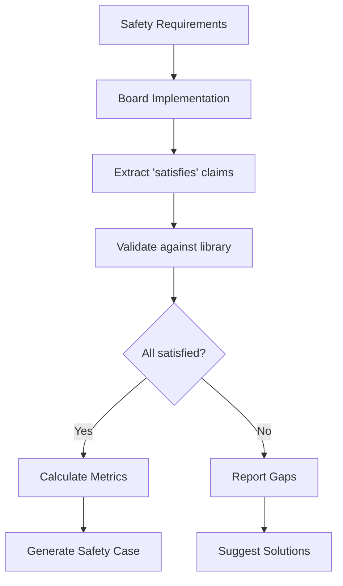

# Complete Functional Safety Architecture for BHDL
## Unified Multi-Phase Architecture with Clear Semantics

### Executive Summary

This document presents the complete functional safety architecture for BHDL, incorporating:
- Multi-phase parallel development workflow
- Clear separation between operational intent (`for`) and compliance (`satisfies`)
- Component library architecture with failure modes (not effects)
- Context-sensitive effect generation
- Semi-automated requirement generation
- Support for external safety mechanisms

### Core Architecture Principles

#### 1. Parallel Development
Safety engineers and board designers work in parallel from day one, not sequentially.

#### 2. Separation of Concerns
- **Safety Engineer**: Defines hazards, safety goals, and abstract requirements
- **Board Designer**: Implements with component selection freedom
- **Tool**: Validates compliance and generates context-sensitive analysis

#### 3. Clean Semantic Separation
- **`for` keyword**: Operational intent (what the circuit does during operation)
- **`satisfies` keyword**: Compliance declaration (what requirements are met)

### Language Constructs

#### Operational Intent (`for`)
Captures the runtime purpose of signal flows:

```bhdl
// Intent describes what the signal path is doing
net sensor_path: @SENSOR -> filter -> amp -> adc
    for signal_conditioning(gain: 10, bandwidth: 1kHz);

net power_distribution: @12V -> reg: LM2596(5V) -> @5V_OUT
    for voltage_regulation(efficiency: 85%, ripple: <50mV);
```

#### Compliance Declaration (`satisfies`)
Declares what requirements or capabilities are fulfilled:

```bhdl
// Component declares what it satisfies
component LTC2954 {
    electrical { ... }
    behavioral { ... }
    failure_modes { ... }
    
    satisfies [VoltageMonitoring, SelfTestable] {
        VoltageMonitoring: {
            range: 2.7V..28V;
            response_time: 50µs;
        }
        SelfTestable: {
            coverage: 87%;
            interval: 100ms;
        }
    }
}

// Board declares requirement satisfaction
board PowerSupply {
    // ... implementation ...
    
    satisfies {
        REQ_PSU_001: via monitor;  // Tool validates
        REQ_PSU_002: via [monitor.self_test];
        VoltageMonitoring: via monitor_circuit;
    }
}
```

### Three-Phase Workflow

#### Phase 1: System Safety Analysis (Day 1)
**When**: Immediately, before any board design exists
**Who**: Safety engineer
**Output**: Safety requirements and functional constraints

```bhdl
// Phase 1: Abstract safety analysis
system_safety AutomotivePowerSafety {
    application_context {
        domain: automotive;
        system: body_control_module;
        asil_target: ASIL_B;
    }
    
    // Functional blocks without implementation
    functional_blocks {
        power_input: BatteryInterface {
            voltage_range: 9V..16V;
            max_current: 5A;
        }
        
        primary_regulation: VoltageRegulation {
            output_voltage: 5V ± 2%;
            max_current: 3A;
            // No component specified
        }
        
        critical_loads: SafetyECU {
            power_tolerance: 5V ± 3%;
            asil_level: ASIL_B;
        }
    }
    
    // Hazard analysis
    hazards {
        H1: {
            description: "Loss of power to safety ECU";
            severity: S2;
            exposure: E4;
            controllability: C2;
            asil: ASIL_B;
        }
    }
    
    // Abstract safety requirements
    safety_functions {
        SF1: {
            description: "Monitor output voltage";
            allocated_to: primary_regulation;
            coverage_target: ≥90%;  // ASIL B SPFM
            response_time: ≤100µs;
        }
    }
}
```

#### Phase 2: Board Implementation (Parallel)
**When**: In parallel with Phase 1
**Who**: Board designer
**Output**: Actual circuit implementation

```bhdl
// Phase 2: Board designer implements with freedom
board PowerSupply {
    // Designer chooses components
    @12V -> reg: LM2596(5V, 3A) {
        // Intent for operational analysis
        for voltage_regulation(efficiency: 85%);
    };
    
    @5V -> monitor: LTC2954 {
        // No safety attributes - tool knows from library
    };
    
    // Designer handles electrical details
    monitor.FAULT_N -> mcu.PWR_FAULT;
    
    // Declaration of what this satisfies
    satisfies {
        // Tool validates these claims
        REQ_PSU_001: via monitor;
        VoltageMonitoring: via monitor;
    }
}
```

#### Phase 3: Automatic Validation (Tool)
**When**: Continuously as design evolves
**Who**: Tool with safety engineer review
**Output**: Compliance validation and metrics

```bhdl
// Phase 3: Tool-generated validation
automatic_validation {
    board: PowerSupply;
    safety_spec: AutomotivePowerSafety;
    
    requirement_compliance {
        REQ_PSU_001: {
            requirement: "Monitor 5V with response ≤100µs";
            implementation: LTC2954;
            
            // Tool extracts from component library
            actual_response: 50µs;
            status: PASS;  // 50µs < 100µs
        }
    }
    
    // Tool checks satisfies declarations
    satisfaction_validation {
        VoltageMonitoring: {
            required_by: SF1;
            claimed_by: monitor;
            
            validation: {
                component_satisfies: LTC2954 in [VoltageMonitoring];
                parameters_met: true;
                status: VERIFIED;
            }
        }
    }
    
    calculated_metrics {
        spfm: 93.0%;  // > 90% required
        lfm: 66.7%;   // > 60% required
        pmhf: 3FIT;   // < 100FIT required
        asil_compliance: ASIL_B_SATISFIED;
    }
}
```

### Component Library Architecture

#### Failure Modes Only (No Effects)
Components define failure modes but NOT effects (context-dependent):

```bhdl
component LM2596 {
    // Electrical and behavioral models
    electrical_model { ... }
    behavioral_model { ... }
    
    // SEooC data from vendor
    seooc_data {
        vendor: "Texas Instruments";
        document: "LM2596-SM Rev C";
        permanent_die_failures: 15FIT;
        package_failures: 8FIT;
        total: 23FIT;
    }
    
    // ONLY failure modes - NO effects
    failure_modes {
        no_switching: {
            rate: 6FIT;
            description: "PWM controller failure";
            observable_symptom: "0V output";
            // NO "system shutdown" effect
        }
        
        overvoltage_runaway: {
            rate: 4FIT;
            description: "Feedback loop failure";
            observable_symptom: "output > spec";
            // NO severity - context dependent
        }
    }
    
    // What this component satisfies
    satisfies [VoltageRegulation, CurrentLimiting] {
        VoltageRegulation: {
            method: switching_buck;
            efficiency: 85%;
        }
        CurrentLimiting: {
            threshold: 3A;
            method: cycle_by_cycle;
        }
    }
}
```

### Context-Sensitive Effect Generation

The tool generates effects based on actual circuit context:

```bhdl
// Same component, different contexts, different effects
failure_effect_analysis {
    LM2596_no_switching: {
        failure_mode: "PWM controller failure";
        
        // Context 1: Powers safety ECU
        context_safety_ecu: {
            downstream: [safety_ecu<ASIL_B>];
            generated_effect: "Safety ECU loses power";
            severity: 8;  // Critical
        }
        
        // Context 2: Powers LED array
        context_led_driver: {
            downstream: [led_array<QM>];
            generated_effect: "LEDs turn off";
            severity: 2;  // Minor
        }
    }
}
```

### External Safety Mechanisms

Circuits (not just components) can satisfy safety requirements:

```bhdl
// External monitoring circuit
circuit_fragment VoltageMonitoringCircuit {
    components {
        comp: LM393;  // Basic comparator
        ref: TL431;   // Voltage reference
        r1, r2: Resistor;  // Divider
    }
    
    connections {
        @5V -> r1.1;
        r1.2 -> r2.1 -> comp.IN+;
        r2.2 -> @GND;
        ref.OUT -> comp.IN-;
        comp.OUT -> @FAULT_N;
    }
    
    // Circuit satisfies capability
    satisfies VoltageMonitoring {
        monitored_voltage: @5V;
        threshold: 5.5V;
        response_time: 10µs;
    }
}

// Board uses external circuit for safety
board PowerSupply {
    // Basic regulator without monitoring
    reg: LM7805;  // Doesn't satisfy VoltageMonitoring
    
    // External monitoring
    monitor: VoltageMonitoringCircuit;
    
    // Together they satisfy requirements
    satisfies {
        VoltageRegulation: via reg;
        VoltageMonitoring: via monitor;  // External circuit
        REQ_PSU_001: via [reg, monitor];  // Composite
    }
}
```

### Semi-Automated Requirement Generation

Tool generates templates, safety engineer completes:

```bhdl
// Tool-generated template
generated_requirement_template {
    REQ_PSU_001: {
        source: "SF1";
        type: safety;
        asil: ASIL_B;  // Inherited
        
        description: "[SPECIFY: What to monitor and how]";
        
        // Template based on pattern
        monitoring {
            signal: "[SPECIFY: voltage/current/temp]";
            threshold: "[SPECIFY: value and tolerance]";
            response_time: "[SPECIFY: max time]";
        }
    }
}

// Safety engineer completes
completed_requirement {
    REQ_PSU_001: {
        source: "SF1";
        type: safety;
        asil: ASIL_B;
        
        description: "Monitor 5V rail for overvoltage";
        
        monitoring {
            signal: "5V power rail";
            threshold: 5.5V ± 2%;
            response_time: ≤100µs;
        }
    }
}
```

### Key Benefits

1. **Clean Semantics**: `for` = operation, `satisfies` = compliance
2. **Parallel Development**: Safety and board design proceed together
3. **Context Awareness**: Effects generated from actual circuit
4. **Flexibility**: Components or circuits can satisfy requirements
5. **Traceability**: Clear path from hazards to implementation
6. **Automation**: Tool validates all satisfaction claims

### Tool Validation Flow



### Conclusion

This architecture provides:
- **Clear separation** between operational intent and compliance
- **Maximum flexibility** for board designers
- **Rigorous validation** of safety requirements
- **Context-sensitive** analysis
- **Support for any implementation** strategy (integrated or external)

The `satisfies` keyword creates a declarative, verifiable link between requirements and implementation, while `for` captures operational intent for simulation and analysis.