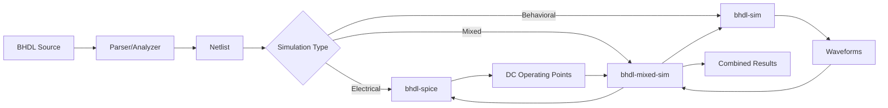

# BHDL Simulation Architecture Proposal

## Executive Summary

This proposal addresses the relationship between `bhdl-spice` and `bhdl-sim`, two simulation-related crates in the BHDL toolchain. While both deal with circuit simulation, they serve fundamentally different purposes and use different approaches. This document proposes maintaining them as separate, specialized tools while creating integration points to leverage their complementary strengths.

Key challenges addressed include:
- Nebulous analog/digital boundaries (e.g., MOSFETs in active region)
- Digital I/O level validation (VIH, VIL requirements)
- Hysteresis effects from Schmitt triggers or diode-resistor networks
- Voltage compatibility between different logic families

The proposal introduces an intent-based classification approach leveraging BHDL's high-level abstractions to capture design intent (e.g., `combined_net: Q1_OUT | Q2_OUT`, `delayed_net: inverted_net after 3ms`), enabling intelligent simulation mode selection based on what the designer intended rather than trying to automatically detect boundaries.

## Current State Analysis

### bhdl-spice: Electrical Analysis Engine

**Purpose**: SPICE-like electrical analysis for circuit validation and parameter extraction

**Key Features**:
- Newton-Raphson nonlinear DC solver
- Electrical safety analysis with violation detection
- Component parameter inference (e.g., LED forward voltage)
- Power domain analysis and propagation
- AC analysis for stability (phase/gain margins)
- Topology-based component role detection

**Technical Approach**:
- Solves Kirchhoff's laws using nodal analysis
- Builds and solves system of nonlinear equations
- Iterates to find steady-state operating points
- Models components using electrical equations (Ohm's law, diode equations, etc.)

**Typical Use Cases**:
- Verify electrical safety before PCB fabrication
- Calculate operating points and power consumption
- Infer missing component parameters
- Validate power supply stability
- Check for electrical rule violations

### bhdl-sim: Behavioral Simulation Engine

**Purpose**: Time-based behavioral simulation for functional verification

**Key Features**:
- Time-stepped simulation with adaptive control
- Event-driven architecture with priority scheduling
- Behavioral component models (analog, digital, mixed-signal)
- Waveform capture with VCD output
- Interactive debugging with breakpoints
- Checkpoint/restore for long simulations

**Technical Approach**:
- Advances through time in discrete steps
- Executes behavioral models at each timestep
- Propagates signals through pins and nets
- Captures state changes for waveform viewing

**Typical Use Cases**:
- Verify digital logic functionality
- Simulate mixed-signal behavior
- Generate timing diagrams
- Debug complex sequential behavior
- Validate communication protocols

## Key Differences

| Aspect | bhdl-spice | bhdl-sim |
|--------|------------|----------|
| **Domain** | Electrical/Physical | Behavioral/Functional |
| **Time Model** | Steady-state (DC) or frequency (AC) | Time-stepped progression |
| **Equations** | KCL/KVL, device physics | Behavioral models, logic |
| **Output** | Operating points, currents/voltages | Waveforms, events, states |
| **Computation** | Matrix solving, Newton-Raphson | Event processing, state updates |
| **Focus** | Electrical correctness | Functional correctness |

## Key Challenges

### Analog/Digital Boundary Detection

The distinction between analog and digital regions is often nebulous and context-dependent. A MOSFET intended as a digital inverter might actually operate in the active region rather than saturation/cutoff, requiring analog-accurate modeling. This presents several challenges:

1. **Operating Region Detection**: Components can transition between digital and analog behavior based on:
   - Input signal characteristics (rise time, voltage levels)
   - Load conditions (capacitive loading, fan-out)
   - Power supply variations
   - Temperature effects

2. **Performance vs. Accuracy Trade-offs**: 
   - Digital abstraction is fast but may miss critical behavior
   - Analog modeling is accurate but computationally expensive
   - Need dynamic switching between models based on circuit conditions

3. **Validation Requirements**: Must detect when simplified models are invalid:
   - MOSFETs not fully switching (active region operation)
   - Logic gates with slow transitions (non-ideal switching)
   - Analog effects in "digital" circuits (ground bounce, crosstalk)

### Digital I/O Level Validation

Digital simulations typically use simple HIGH/LOW abstractions, missing critical voltage level requirements:

1. **Input Threshold Violations**: 
   - VIH (Input High Voltage) - minimum voltage for logic HIGH
   - VIL (Input Low Voltage) - maximum voltage for logic LOW
   - Undefined region between VIL and VIH where behavior is unpredictable
   - Different logic families have different thresholds (TTL, CMOS, LVTTL, etc.)

2. **Hysteresis Effects**:
   - Schmitt trigger inputs with different rising/falling thresholds
   - Diode-resistor networks creating voltage-dependent behavior
   - State-dependent input thresholds that digital models miss

3. **Real-World Examples**:
   - 3.3V logic driving 5V inputs may not meet VIH requirements
   - Slow rise times through undefined region causing oscillations
   - Pull-up resistors too weak to guarantee VIH under load
   - Noise margins violated by ground bounce or supply droop

## Integration Opportunities

### 1. Initial Condition Strategies

**Problem**: Behavioral simulations need realistic initial conditions, but real circuits have startup transients.

**Solutions**: 

#### Option A: Start from Zero (Power-On Transient)
Model the actual power-on behavior:
```rust
// Start with all voltages at zero (power off)
let initial_state = bhdl_sim::CircuitState::zero();
let sim_engine = bhdl_sim::SimulationEngine::with_initial_state(initial_state);

// Apply power and simulate the ramp-up
sim_engine.set_power_supply_ramp(
    "VCC", 
    RampProfile::linear(0.0, 5.0, 1e-3) // 0V to 5V over 1ms
);
```

#### Option B: DC Operating Point (Steady-State)
Skip startup transient for faster functional simulation:
```rust
// Use SPICE to find steady-state
let dc_results = bhdl_spice::analyze_dc(&netlist)?;
let initial_state = bhdl_sim::CircuitState::from_dc_analysis(dc_results);
let sim_engine = bhdl_sim::SimulationEngine::with_initial_state(initial_state);
```

#### Option C: Hybrid Approach (Recommended)
Use SPICE transient analysis for accurate startup, then switch to behavioral:
```rust
// SPICE handles the analog-accurate startup transient
let transient_results = bhdl_spice::analyze_transient(&netlist, 0.0, 10e-3)?;

// Extract state at end of startup (e.g., when supplies settle)
let startup_complete_time = detect_steady_state(transient_results);
let initial_state = transient_results.get_state_at(startup_complete_time);

// Continue with behavioral simulation from there
let sim_engine = bhdl_sim::SimulationEngine::with_initial_state(initial_state);
```

#### When to Use Each Approach:
- **Zero Start**: Critical for power sequencing validation, inrush current analysis, soft-start verification
- **DC Start**: Appropriate for functional verification where startup is not important
- **Hybrid**: Best for mixed-signal systems where analog accuracy matters during startup

### 2. Parameter Exchange

**Problem**: Component parameters needed for behavioral models are often specified separately from electrical parameters.

**Solution**: Share parameter definitions and inference results:
```rust
// SPICE infers LED forward voltage
let led_params = spice_results.get_component_params("D1")?;
// Behavioral model uses inferred parameters
let led_model = DigitalLED::new(led_params.forward_voltage);
```

### 3. Mixed-Mode Boundaries

**Problem**: Some circuits have both analog sections (requiring SPICE accuracy) and digital sections (better suited for behavioral simulation).

**Solution**: Define interface points where the two simulators exchange data:
```rust
// Analog section computed by SPICE
let adc_input_voltage = spice_engine.get_node_voltage("adc_in");
// Digital section receives quantized value
behavioral_engine.set_adc_value(quantize(adc_input_voltage));
```

### 4. Electrical Constraint Validation

**Problem**: Behavioral simulations may produce outputs that violate electrical constraints.

**Solution**: Use SPICE to validate behavioral simulation results:
```rust
// Behavioral simulation produces digital output pattern
let output_pattern = behavioral_sim.get_output_pattern();
// SPICE validates electrical feasibility
let violations = spice_engine.check_pattern_feasibility(output_pattern)?;
```

### 5. Dynamic Model Selection (Addressing Nebulous Boundaries)

**Problem**: Components intended for digital operation may actually require analog modeling based on circuit conditions.

**Solution**: Implement adaptive model selection with validation:

#### Detection Strategies:

1. **Operating Point Analysis**:
```rust
// Check if MOSFET is in expected region
let mosfet_state = spice_engine.get_device_state("M1")?;
match mosfet_state.region {
    MosfetRegion::Cutoff | MosfetRegion::Saturation => {
        // Safe for digital abstraction
        behavioral_engine.use_digital_model("M1");
    }
    MosfetRegion::Linear => {
        // Operating in active region - need analog accuracy
        log::warn!("MOSFET M1 in active region - requires analog modeling");
        mixed_sim.mark_for_analog("M1");
    }
}
```

2. **Transition Time Analysis**:
```rust
// Monitor signal transitions
let rise_time = measure_transition_time(&signal);
if rise_time > 0.1 * clock_period {
    // Slow transition - analog effects matter
    mixed_sim.upgrade_to_analog_model(&affected_components);
}
```

3. **Continuous Validation**:
```rust
// During behavioral simulation, periodically validate assumptions
if simulation_time % validation_interval == 0 {
    let validation_results = spice_engine.spot_check(&critical_nodes)?;
    for (node, discrepancy) in validation_results {
        if discrepancy > tolerance {
            // Behavioral model is diverging from reality
            mixed_sim.switch_to_analog_region(&node.connected_components());
        }
    }
}
```

#### Automatic Boundary Adjustment:

```rust
pub struct AdaptiveSimulation {
    analog_regions: HashSet<ComponentId>,
    digital_regions: HashSet<ComponentId>,
    boundary_monitors: Vec<BoundaryMonitor>,
}

impl AdaptiveSimulation {
    pub fn monitor_boundaries(&mut self) -> Result<BoundaryAdjustment> {
        let mut adjustments = BoundaryAdjustment::new();
        
        for monitor in &self.boundary_monitors {
            if monitor.detect_analog_behavior() {
                // Component needs analog modeling
                adjustments.promote_to_analog(monitor.component_id);
                
                // Check neighboring components
                for neighbor in self.get_connected_components(monitor.component_id) {
                    if self.is_digital(neighbor) && monitor.affects_neighbor(neighbor) {
                        adjustments.consider_promotion(neighbor);
                    }
                }
            }
        }
        
        Ok(adjustments)
    }
}
```

### 6. I/O Level Validation System

**Problem**: Digital simulations cannot validate voltage levels against logic family specifications.

**Solution**: Hybrid validation using SPICE for voltage level checks:

#### Logic Family Specifications:
```rust
pub struct LogicFamily {
    pub name: String,
    pub vdd: f64,
    pub vih_min: f64,  // Minimum input high voltage
    pub vil_max: f64,  // Maximum input low voltage
    pub voh_min: f64,  // Minimum output high voltage
    pub vol_max: f64,  // Maximum output low voltage
    pub hysteresis: Option<Hysteresis>,
}

pub struct Hysteresis {
    pub vt_rising: f64,   // Rising threshold
    pub vt_falling: f64,  // Falling threshold
}

// Example: 3.3V CMOS
let cmos_3v3 = LogicFamily {
    name: "CMOS_3.3V".to_string(),
    vdd: 3.3,
    vih_min: 2.0,     // 0.7 * VDD
    vil_max: 0.8,     // 0.3 * VDD
    voh_min: 2.4,
    vol_max: 0.4,
    hysteresis: None,
};
```

#### Validation During Simulation:
```rust
// Check digital signal against I/O specifications
pub fn validate_io_levels(
    spice: &SpiceEngine,
    behavioral: &BehavioralEngine,
    interface: &InterfacePoint,
) -> ValidationResult {
    // Get actual voltage from SPICE
    let voltage = spice.get_node_voltage(&interface.node)?;
    
    // Get expected logic level from behavioral
    let expected_state = behavioral.get_pin_state(&interface.pin)?;
    
    // Check against logic family specs
    let logic_family = interface.get_logic_family();
    
    match expected_state {
        LogicState::High => {
            if voltage < logic_family.vih_min {
                return ValidationResult::Violation {
                    severity: Severity::Error,
                    message: format!(
                        "Input voltage {:.2}V below VIH_min {:.2}V for {}",
                        voltage, logic_family.vih_min, logic_family.name
                    ),
                    suggestion: "Check drive strength, pull-up resistor value, or logic level translation",
                };
            }
        }
        LogicState::Low => {
            if voltage > logic_family.vil_max {
                return ValidationResult::Violation {
                    severity: Severity::Error,
                    message: format!(
                        "Input voltage {:.2}V above VIL_max {:.2}V for {}",
                        voltage, logic_family.vil_max, logic_family.name
                    ),
                    suggestion: "Check pull-down strength or noise coupling",
                };
            }
        }
        LogicState::Undefined => {
            // Voltage in undefined region
            return ValidationResult::Warning {
                message: format!(
                    "Voltage {:.2}V in undefined region ({:.2}V - {:.2}V)",
                    voltage, logic_family.vil_max, logic_family.vih_min
                ),
            };
        }
    }
    
    ValidationResult::Pass
}
```

#### Hysteresis Detection:
```rust
// Detect and model hysteresis effects
pub fn detect_hysteresis(
    circuit: &Circuit,
    node: &NodeId,
) -> Option<HysteresisModel> {
    // Check for Schmitt trigger components
    if let Some(schmitt) = circuit.find_schmitt_trigger_on_node(node) {
        return Some(HysteresisModel::SchmittTrigger(schmitt.get_thresholds()));
    }
    
    // Check for diode-resistor feedback
    if let Some(feedback) = circuit.find_feedback_network(node) {
        if feedback.contains_diode() {
            // Analyze feedback network for hysteresis
            let model = analyze_diode_feedback(&feedback)?;
            return Some(HysteresisModel::DiodeNetwork(model));
        }
    }
    
    None
}

// Apply hysteresis in mixed simulation
impl MixedSimulation {
    pub fn process_hysteretic_input(&mut self, input: &Input) -> Result<()> {
        let voltage = self.spice.get_voltage(&input.node)?;
        let previous_state = self.behavioral.get_state(&input.pin)?;
        
        let new_state = match &input.hysteresis {
            Some(hyst) => hyst.evaluate(voltage, previous_state),
            None => LogicFamily::evaluate_simple(voltage),
        };
        
        self.behavioral.set_state(&input.pin, new_state)?;
        Ok(())
    }
}
```

### Alternative Approach: Signal Path Classification

Given the impossibility of clean boundaries, a more practical approach:

```rust
pub enum SignalPathComplexity {
    SimpleDigital,      // Pure logic gates, no analog effects
    DigitalWithTiming,  // Digital with critical timing requirements
    MixedSignal,        // Analog effects affect digital behavior
    AnalogRequired,     // Cannot be abstracted to digital
}

impl MixedSimulation {
    pub fn classify_signal_paths(&self) -> HashMap<PathId, SignalPathComplexity> {
        let mut classifications = HashMap::new();
        
        for path in self.enumerate_paths() {
            let complexity = match path {
                _ if path.has_rc_networks() => SignalPathComplexity::AnalogRequired,
                _ if path.has_open_collector() => SignalPathComplexity::MixedSignal,
                _ if path.has_multiple_drivers() => SignalPathComplexity::MixedSignal,
                _ if path.crosses_voltage_domains() => SignalPathComplexity::MixedSignal,
                _ if path.has_timing_constraints() => SignalPathComplexity::DigitalWithTiming,
                _ => SignalPathComplexity::SimpleDigital,
            };
            classifications.insert(path.id, complexity);
        }
        
        classifications
    }
    
    pub fn simulation_strategy(&self, path: &Path) -> SimulationMode {
        // Instead of boundaries, use graduated accuracy levels
        match self.classify_path(path) {
            SignalPathComplexity::SimpleDigital => {
                SimulationMode::PureDigital
            }
            SignalPathComplexity::DigitalWithTiming => {
                SimulationMode::DigitalWithAnalogValidation {
                    check_interval: 100, // Check every 100 events
                }
            }
            SignalPathComplexity::MixedSignal => {
                SimulationMode::ContinuousAnalog {
                    digital_abstractions: true, // Use where safe
                }
            }
            SignalPathComplexity::AnalogRequired => {
                SimulationMode::FullAnalog
            }
        }
    }
}
```

### Pragmatic Mixed Simulation Guidelines

1. **Accept There Are No Clean Boundaries**: Stop trying to partition into analog/digital regions
2. **Use Path-Based Analysis**: Classify signal paths by complexity, not components
3. **Graduated Accuracy**: Apply analog modeling where needed, not everywhere
4. **User Guidance**: Let users override classifications based on their knowledge
5. **Performance Trade-offs**: Make accuracy vs. speed choices explicit

### Intent-Based Classification: The BHDL Advantage

BHDL's higher abstraction level provides a unique opportunity to capture design intent, enabling intelligent simulation mode selection:

```bhdl
// Current BHDL: Structure without intent
net combined: OC_OUT1.OUT -> OC_OUT2.OUT -> R1(4.7k).1;
net delayed: combined -> R3(1k).1 -> C1(100pF).1 -> DIG_IN.IN;

// Future BHDL: Structure with intent
net combined: OC_OUT1.OUT | OC_OUT2.OUT;  // Wired-OR intent
net inverted: ~combined;                   // Digital inversion intent
net delayed: inverted after 3ms;          // Timing delay intent

// Even more explicit intent
net bus_ready: device1.ready & device2.ready;  // Digital AND
net bus_request: req1 | req2 | req3;          // Digital OR
net debounced: button_in stable_for 20ms;     // Debouncing intent
```

This intent information enables intelligent classification:

```rust
impl IntentBasedClassifier {
    pub fn classify_from_bhdl(&self, net: &NetDeclaration) -> SimulationStrategy {
        match &net.intent {
            NetIntent::WiredOr { drivers } => {
                // We know it's meant as digital, but needs analog for pull-ups
                SimulationStrategy::DigitalWithAnalogValidation {
                    validate_rise_time: true,
                    check_voltage_levels: true,
                }
            }
            NetIntent::DigitalInversion => {
                // Pure digital unless connected to analog regions
                SimulationStrategy::DigitalPreferred
            }
            NetIntent::TimingDelay { delay } => {
                if delay > &Duration::from_micros(1) {
                    // Large delays likely use RC networks
                    SimulationStrategy::AnalogRequired
                } else {
                    // Small delays might be gate propagation
                    SimulationStrategy::DigitalWithTiming
                }
            }
            NetIntent::Debounce { stable_time } => {
                // Definitely needs analog for RC filtering
                SimulationStrategy::AnalogRequired
            }
            NetIntent::AnalogFilter { .. } => {
                // Explicitly analog
                SimulationStrategy::FullAnalog
            }
        }
    }
}
```

### BHDL Language Extensions for Intent

Proposed syntax extensions to capture design intent:

```bhdl
// Combinational logic intent
net decoded: select match {
    2'b00 => out1,
    2'b01 => out2,
    2'b10 => out3,
    2'b11 => out4,
};

// Timing intent
net synchronized: async_signal clocked_by sys_clk;
net delayed_enable: enable after setup_time;

// Analog intent
net filtered: noisy_input through low_pass(cutoff: 1kHz);
net averaged: sensor_reading moving_average(window: 10ms);

// Mixed-signal boundaries
interface ADC_Input {
    analog vref: voltage;
    analog vin: voltage range 0..vref;
    digital[12] dout: logic;
    
    behavior sample_rate: 1MHz;
    behavior resolution: 12 bits;
}
```

This approach leverages BHDL's raison d'être - increasing abstraction level - to solve the boundary problem elegantly.

## Proposed Architecture

### Option 1: Keep Separate (Recommended)

Maintain `bhdl-spice` and `bhdl-sim` as independent crates with well-defined interfaces:

```
┌─────────────┐     ┌─────────────┐     ┌──────────────────┐
│ bhdl-spice  │     │  bhdl-sim   │     │ bhdl-mixed-sim   │
│             │     │             │     │ (new bridge)     │
│ - DC solver │     │ - Time step │     │                  │
│ - AC analysis│    │ - Events    │     │ - Initialization │
│ - Safety    │     │ - Behavioral│     │ - Co-simulation  │
│ - Inference │     │ - Waveforms │     │ - Parameter sync │
└─────────────┘     └─────────────┘     └──────────────────┘
       ▲                    ▲                    │
       └────────────────────┴────────────────────┘
```

**Advantages**:
- Clear separation of concerns
- Can use either tool independently
- Easier to maintain and test
- No performance overhead when using only one
- Allows different development velocities

**Disadvantages**:
- Some code duplication (circuit representation)
- Need to maintain interfaces between them
- Users must understand when to use which tool

### Option 2: Monolithic Merger (Not Recommended)

Combine both into a single `bhdl-simulation` crate:

```
┌─────────────────────────┐
│   bhdl-simulation       │
│                         │
│ ┌─────────┬──────────┐ │
│ │ SPICE   │ Behavioral│ │
│ │ Engine  │ Engine    │ │
│ └─────────┴──────────┘ │
│                         │
│   Shared Infrastructure │
└─────────────────────────┘
```

**Advantages**:
- Single API surface
- Easier resource sharing
- Tighter integration possible

**Disadvantages**:
- Large, complex codebase
- Conflicting requirements (numerical stability vs. simulation speed)
- Harder to test in isolation
- Risk of feature creep
- Performance overhead even when using one engine

### Option 3: Shared Core with Plugins

Create a simulation framework with pluggable engines:

```
┌─────────────────────────────┐
│   bhdl-sim-core             │
│   - Circuit representation  │
│   - Common infrastructure   │
└──────────┬──────────────────┘
           │
    ┌──────┴──────┐
    ▼             ▼
┌─────────┐  ┌──────────┐
│ SPICE   │  │Behavioral│
│ Plugin  │  │ Plugin   │
└─────────┘  └──────────┘
```

**Advantages**:
- Extensible architecture
- Shared infrastructure
- Clear plugin boundaries

**Disadvantages**:
- Over-engineering for two engines
- Plugin interface constraints
- Added complexity

## Recommendation: Hybrid Approach with Adaptive Boundaries

1. **Keep `bhdl-spice` and `bhdl-sim` as separate crates**
2. **Create `bhdl-mixed-sim` as an optional integration layer**
3. **Standardize shared data structures in `bhdl-common`**
4. **Implement adaptive boundary detection to handle nebulous analog/digital regions**
5. **Use signal path classification instead of component-based boundaries**
6. **Provide user controls to override automatic classification**

### Implementation Plan

#### Phase 1: Standardization (2-3 weeks)
- Move shared types to `bhdl-common`:
  - Circuit representation interfaces
  - Component parameter definitions
  - Pin/Net value types
- Ensure both crates use these common types

#### Phase 2: Bridge Development (3-4 weeks)
Create `bhdl-mixed-sim` with:
- DC initialization from SPICE to behavioral
- Parameter synchronization
- Results validation framework
- Simple co-simulation for mixed analog/digital

#### Phase 3: Advanced Integration (4-6 weeks)
- Event-based communication between simulators
- Automatic boundary detection
- Performance optimizations
- Comprehensive test suite

#### Phase 4: Adaptive Boundary System (3-4 weeks)
- MOSFET operating region detection
- Transition time monitoring
- Continuous validation framework
- Dynamic model switching
- Neighbor effect propagation
- Performance impact mitigation

#### Phase 5: BHDL Intent Extensions (4-6 weeks)
- Design and implement intent syntax extensions
- Add operators: `|` (wired-OR), `&` (wired-AND), `~` (inversion)
- Add timing constructs: `after`, `stable_for`, `clocked_by`
- Add analog constructs: `through`, `moving_average`
- Update parser and AST to capture intent
- Implement intent-based classification engine

### Example API

```rust
use bhdl_mixed_sim::{MixedSimulation, SimulationMode};

// Create mixed simulation
let mut mixed_sim = MixedSimulation::new(netlist);

// Configure regions
mixed_sim.mark_analog_region(&["power_supply", "analog_frontend"]);
mixed_sim.mark_digital_region(&["mcu", "digital_logic"]);

// Set up initial conditions from DC analysis
mixed_sim.initialize_from_dc()?;

// Run co-simulation
mixed_sim.run_until(1e-3)?; // Run for 1ms

// Get results from both domains
let analog_waveforms = mixed_sim.get_analog_waveforms();
let digital_waveforms = mixed_sim.get_digital_waveforms();
```

## Benefits of Separation

1. **Specialized Optimization**: Each engine can be optimized for its specific use case
2. **Independent Evolution**: Features can be added without affecting the other engine
3. **Clear Mental Model**: Users know which tool to reach for
4. **Testing Isolation**: Easier to test numerical stability vs. behavioral correctness
5. **Performance**: No overhead when using only one engine
6. **Adaptive Accuracy**: Can dynamically adjust modeling fidelity based on circuit behavior

## Risks and Mitigation

| Risk | Mitigation |
|------|------------|
| API divergence | Regular sync meetings, shared interfaces |
| Duplicate maintenance | Shared infrastructure in `bhdl-common` |
| User confusion | Clear documentation and examples |
| Integration bugs | Comprehensive integration test suite |
| Boundary detection overhead | Intelligent monitoring intervals, caching |
| False positives in region detection | Hysteresis and confidence thresholds |
| Model switching discontinuities | Smooth transitions, state preservation |
| No clean boundaries in many circuits | Signal path classification approach |
| Complex analog effects in "digital" circuits | Accept graduated accuracy levels |
| User confusion about simulation modes | Clear documentation of trade-offs |

## Success Metrics

1. **Functionality**: Both engines work independently and together
2. **Performance**: No regression in individual engine performance
3. **Usability**: Clear when to use which tool
4. **Maintainability**: Clean interfaces, good test coverage
5. **Adoption**: Users successfully combine both tools
6. **Accuracy**: Catches I/O level violations and operating region issues
7. **Coverage**: Detects hysteresis effects and voltage compatibility problems

## Conclusion

Keeping `bhdl-spice` and `bhdl-sim` as separate, specialized tools while providing optional integration through `bhdl-mixed-sim` offers the best balance of:
- Architectural clarity
- Implementation flexibility
- User choice
- Performance optimization
- Maintainability
- Adaptive accuracy for nebulous analog/digital boundaries

This approach recognizes that electrical analysis and behavioral simulation are fundamentally different problems that benefit from different approaches, while still allowing users to leverage both when needed. Critically, it addresses the reality that the analog/digital boundary is often context-dependent and dynamic, requiring intelligent detection and adaptation to ensure accurate simulation results.

The proposed adaptive boundary system ensures that components like MOSFETs operating as digital inverters but exhibiting analog behavior (active region operation) are properly detected and modeled with appropriate fidelity, preventing silent accuracy loss in simulations.

However, as demonstrated by the open-collector/RC network example, many real circuits have no clean analog/digital boundaries. The signal path classification approach provides a more pragmatic solution, accepting that boundaries are fluid and context-dependent rather than fixed and automatic.

Most importantly, BHDL's fundamental advantage - raising the abstraction level - provides the key to solving this problem. By capturing design intent in the language itself (e.g., `wired_or`, `after 3ms`, `stable_for 20ms`), we enable intelligent simulation mode selection based on what the designer intended, not what we can infer from the structure. This is a profound insight that aligns perfectly with BHDL's core philosophy.

## Next Steps

1. Review and approve this proposal
2. Create `bhdl-mixed-sim` crate structure
3. Identify and move shared types to `bhdl-common`
4. Implement basic DC initialization bridge
5. Create example mixed-signal circuits
6. Document best practices for using both tools
7. Design BHDL language extensions for capturing design intent
8. Implement intent-based classification system

## Appendix: Technical Details

### Transient Analysis Requirements

For proper startup modeling, `bhdl-spice` would need transient analysis capabilities:

```rust
// Proposed transient analysis API
pub struct TransientAnalysis {
    pub start_time: f64,
    pub stop_time: f64,
    pub time_step: f64,
    pub initial_conditions: InitialConditions,
}

impl SpiceEngine {
    pub fn analyze_transient(&mut self, config: TransientAnalysis) -> Result<TransientResults> {
        // Use implicit integration methods (e.g., Backward Euler, Trapezoidal)
        // Handle reactive components (capacitors, inductors)
        // Model time-dependent sources (ramps, steps)
    }
}
```

This would enable:
- Accurate power supply ramp-up modeling
- RC time constant effects
- Inrush current analysis
- Soft-start behavior
- Power sequencing validation

### Data Flow Example



### Component Model Sharing

```rust
// In bhdl-common
pub trait ComponentModel {
    fn electrical_params(&self) -> ElectricalParams;
    fn behavioral_params(&self) -> BehavioralParams;
}

// In bhdl-spice
impl SpiceModel for Resistor {
    fn evaluate(&self, v: f64) -> f64 {
        v / self.electrical_params().resistance
    }
}

// In bhdl-sim  
impl BehavioralModel for Resistor {
    fn propagate(&self, input: PinValue) -> PinValue {
        // Use same resistance value
        let r = self.electrical_params().resistance;
        // Apply behavioral rules
    }
}
```

### Boundary Detection Example: MOSFET Inverter

Consider a MOSFET inverter that transitions between analog and digital behavior:

```rust
// Initial setup - assume digital behavior
let mut mixed_sim = MixedSimulation::new(netlist);
mixed_sim.mark_digital_region(&["MOSFET_inverter"]);

// During simulation - monitor actual behavior
mixed_sim.add_boundary_monitor(BoundaryMonitor {
    component_id: "M1",
    thresholds: MonitorThresholds {
        vgs_digital_min: 0.0,      // Fully off
        vgs_digital_max: 5.0,      // Fully on
        vgs_linear_range: 0.7..4.3, // Active region
        transition_time_max: 5e-9,  // 5ns max for digital
    },
});

// Simulation detects slow input rise time
// Input: 0V -> 5V over 50ns (slow for digital)
let monitor_result = mixed_sim.check_boundaries();
// Result: MOSFET spends significant time in linear region

// System automatically switches to analog modeling
mixed_sim.promote_to_analog("M1")?;
// Also checks downstream effects
mixed_sim.analyze_fanout_impact("M1")?;

// Generate warning for user
log::warn!(
    "MOSFET M1 operating in linear region for 40% of transition time. \
     Switched to analog modeling for accuracy. \
     Consider faster input driver or different transistor sizing."
);
```

This approach ensures:
1. **Accuracy**: Circuit behavior is correctly modeled regardless of intended use
2. **Performance**: Only use expensive analog modeling when necessary
3. **Visibility**: Users are informed when components behave unexpectedly
4. **Adaptability**: Simulation adjusts to actual circuit conditions

### Real-World I/O Level Challenge Example

Consider a common scenario: 3.3V microcontroller interfacing with 5V logic:

```rust
// Problematic circuit that digital simulation would miss
// MCU (3.3V CMOS) -> Pull-up to 5V -> 5V TTL Input

// Digital simulation sees: HIGH -> HIGH (seems fine)
// Reality: 3.3V < 4.0V (TTL VIH_min) - FAILURE!

// Mixed simulation detects the issue:
let validation = mixed_sim.validate_interface("MCU_OUT", "TTL_IN")?;
// Error: Output voltage 3.3V below VIH_min 4.0V for 5V_TTL
// Suggestion: Add level shifter or use open-drain with 5V pull-up

// Another subtle case: Weak pull-up with capacitive load
// Digital simulation: Works fine
// Reality: Rise time too slow, undefined region causes glitches

// With hysteresis network (diode + resistor feedback):
let hysteresis_model = mixed_sim.detect_hysteresis("BUTTON_INPUT")?;
// Detected: Diode network creating 0.7V hysteresis window
// Digital model updated to include state-dependent thresholds
```

This demonstrates why pure digital simulation is insufficient for real-world circuits.

### The Boundary Definition Challenge

Consider this seemingly "digital" circuit that defies clean boundary definition:

```rust
// Two open-collector outputs with different pull-ups, RC delay, then digital input
// Where exactly is the analog/digital boundary?

// Component chain:
// OC_Output_1 ----+---- R1(4.7k) ---- VCC
//                 |
// OC_Output_2 ----+---- R2(10k) ----- VCC  
//                 |
//                 +---- R3(1k) ---- C1(100pF) ---- Digital_Input
//
// This "digital" circuit has multiple analog effects:
// 1. Wired-OR with asymmetric rise/fall times due to different pull-ups
// 2. RC delay network for setup time (analog time constant)
// 3. Voltage levels depend on which outputs are pulling low
// 4. Capacitor charging curve affects timing
// 5. Digital input threshold crossing time varies with temperature

// Attempting to find the boundary:
let boundary_analysis = mixed_sim.analyze_boundary(&circuit)?;
// Result: No clean boundary exists!
// - Open collectors: Need analog to model pull-up currents
// - RC network: Fundamentally analog behavior
// - Digital input: Needs analog to validate timing

// The entire signal path requires analog accuracy:
match mixed_sim.classify_network(&signal_path) {
    NetworkType::PureDigital => unreachable!(),
    NetworkType::PureAnalog => {
        // Even "digital" pins need analog modeling here
    }
    NetworkType::Hybrid => {
        // No clean separation possible
        // Must model entire path with analog accuracy
    }
}

// Worse: The boundary shifts with operating conditions
// - Fast edges: More digital-like behavior  
// - Slow edges: Analog effects dominate
// - Multiple drivers: Complex current sharing
```

This example shows why automatic boundary detection is fundamentally flawed for many real circuits.