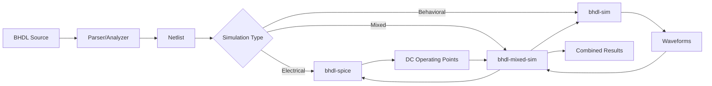

# BHDL Simulation Architecture Proposal

## Executive Summary

This proposal addresses the relationship between `bhdl-spice` and `bhdl-sim`, two simulation-related crates in the BHDL toolchain. While both deal with circuit simulation, they serve fundamentally different purposes and use different approaches. This document proposes maintaining them as separate, specialized tools while creating integration points to leverage their complementary strengths.

Key challenges addressed include:
- Nebulous analog/digital boundaries (e.g., MOSFETs in active region)
- Digital I/O level validation (VIH, VIL requirements)
- Hysteresis effects from Schmitt triggers or diode-resistor networks
- Voltage compatibility between different logic families

The proposal introduces an intent-based classification approach leveraging BHDL's high-level abstractions to capture design intent (e.g., `combined_net: Q1_OUT | Q2_OUT`, `delayed_net: inverted_net after 3ms`), enabling intelligent simulation mode selection based on what the designer intended rather than trying to automatically detect boundaries.

## Current State Analysis

### bhdl-spice: Electrical Analysis Engine

**Purpose**: SPICE-like electrical analysis for circuit validation and parameter extraction

**Key Features**:
- Newton-Raphson nonlinear DC solver
- Electrical safety analysis with violation detection
- Component parameter inference (e.g., LED forward voltage)
- Power domain analysis and propagation
- AC analysis for stability (phase/gain margins)
- Topology-based component role detection

**Technical Approach**:
- Solves Kirchhoff's laws using nodal analysis
- Builds and solves system of nonlinear equations
- Iterates to find steady-state operating points
- Models components using electrical equations (Ohm's law, diode equations, etc.)

**Typical Use Cases**:
- Verify electrical safety before PCB fabrication
- Calculate operating points and power consumption
- Infer missing component parameters
- Validate power supply stability
- Check for electrical rule violations

### bhdl-sim: Behavioral Simulation Engine

**Purpose**: Time-based behavioral simulation for functional verification

**Key Features**:
- Time-stepped simulation with adaptive control
- Event-driven architecture with priority scheduling
- Behavioral component models (analog, digital, mixed-signal)
- Waveform capture with VCD output
- Interactive debugging with breakpoints
- Checkpoint/restore for long simulations

**Technical Approach**:
- Advances through time in discrete steps
- Executes behavioral models at each timestep
- Propagates signals through pins and nets
- Captures state changes for waveform viewing

**Typical Use Cases**:
- Verify digital logic functionality
- Simulate mixed-signal behavior
- Generate timing diagrams
- Debug complex sequential behavior
- Validate communication protocols

## Key Differences

| Aspect | bhdl-spice | bhdl-sim |
|--------|------------|----------|
| **Domain** | Electrical/Physical | Behavioral/Functional |
| **Time Model** | Steady-state (DC) or frequency (AC) | Time-stepped progression |
| **Equations** | KCL/KVL, device physics | Behavioral models, logic |
| **Output** | Operating points, currents/voltages | Waveforms, events, states |
| **Computation** | Matrix solving, Newton-Raphson | Event processing, state updates |
| **Focus** | Electrical correctness | Functional correctness |

## Key Challenges

### Analog/Digital Boundary Detection

The distinction between analog and digital regions is often nebulous and context-dependent. A MOSFET intended as a digital inverter might actually operate in the active region rather than saturation/cutoff, requiring analog-accurate modeling. This presents several challenges:

1. **Operating Region Detection**: Components can transition between digital and analog behavior based on:
   - Input signal characteristics (rise time, voltage levels)
   - Load conditions (capacitive loading, fan-out)
   - Power supply variations
   - Temperature effects

2. **Performance vs. Accuracy Trade-offs**: 
   - Digital abstraction is fast but may miss critical behavior
   - Analog modeling is accurate but computationally expensive
   - Need dynamic switching between models based on circuit conditions

3. **Validation Requirements**: Must detect when simplified models are invalid:
   - MOSFETs not fully switching (active region operation)
   - Logic gates with slow transitions (non-ideal switching)
   - Analog effects in "digital" circuits (ground bounce, crosstalk)

### Digital I/O Level Validation

Digital simulations typically use simple HIGH/LOW abstractions, missing critical voltage level requirements:

1. **Input Threshold Violations**: 
   - VIH (Input High Voltage) - minimum voltage for logic HIGH
   - VIL (Input Low Voltage) - maximum voltage for logic LOW
   - Undefined region between VIL and VIH where behavior is unpredictable
   - Different logic families have different thresholds (TTL, CMOS, LVTTL, etc.)

2. **Hysteresis Effects**:
   - Schmitt trigger inputs with different rising/falling thresholds
   - Diode-resistor networks creating voltage-dependent behavior
   - State-dependent input thresholds that digital models miss

3. **Real-World Examples**:
   - 3.3V logic driving 5V inputs may not meet VIH requirements
   - Slow rise times through undefined region causing oscillations
   - Pull-up resistors too weak to guarantee VIH under load
   - Noise margins violated by ground bounce or supply droop

## Integration Opportunities

### 1. Initial Condition Strategies

**Problem**: Behavioral simulations need realistic initial conditions, but real circuits have startup transients.

**Solutions**: 

#### Option A: Start from Zero (Power-On Transient)
Model the actual power-on behavior:
```rust
// Start with all voltages at zero (power off)
let initial_state = bhdl_sim::CircuitState::zero();
let sim_engine = bhdl_sim::SimulationEngine::with_initial_state(initial_state);

// Apply power and simulate the ramp-up
sim_engine.set_power_supply_ramp(
    "VCC", 
    RampProfile::linear(0.0, 5.0, 1e-3) // 0V to 5V over 1ms
);
```

#### Option B: DC Operating Point (Steady-State)
Skip startup transient for faster functional simulation:
```rust
// Use SPICE to find steady-state
let dc_results = bhdl_spice::analyze_dc(&netlist)?;
let initial_state = bhdl_sim::CircuitState::from_dc_analysis(dc_results);
let sim_engine = bhdl_sim::SimulationEngine::with_initial_state(initial_state);
```

#### Option C: Hybrid Approach (Recommended)
Use SPICE transient analysis for accurate startup, then switch to behavioral:
```rust
// SPICE handles the analog-accurate startup transient
let transient_results = bhdl_spice::analyze_transient(&netlist, 0.0, 10e-3)?;

// Extract state at end of startup (e.g., when supplies settle)
let startup_complete_time = detect_steady_state(transient_results);
let initial_state = transient_results.get_state_at(startup_complete_time);

// Continue with behavioral simulation from there
let sim_engine = bhdl_sim::SimulationEngine::with_initial_state(initial_state);
```

#### When to Use Each Approach:
- **Zero Start**: Critical for power sequencing validation, inrush current analysis, soft-start verification
- **DC Start**: Appropriate for functional verification where startup is not important
- **Hybrid**: Best for mixed-signal systems where analog accuracy matters during startup

### 2. Parameter Exchange

**Problem**: Component parameters needed for behavioral models are often specified separately from electrical parameters.

**Solution**: Share parameter definitions and inference results:
```rust
// SPICE infers LED forward voltage
let led_params = spice_results.get_component_params("D1")?;
// Behavioral model uses inferred parameters
let led_model = DigitalLED::new(led_params.forward_voltage);
```

### 3. Mixed-Mode Boundaries

**Problem**: Some circuits have both analog sections (requiring SPICE accuracy) and digital sections (better suited for behavioral simulation).

**Solution**: Define interface points where the two simulators exchange data:
```rust
// Analog section computed by SPICE
let adc_input_voltage = spice_engine.get_node_voltage("adc_in");
// Digital section receives quantized value
behavioral_engine.set_adc_value(quantize(adc_input_voltage));
```

### 4. Electrical Constraint Validation

**Problem**: Behavioral simulations may produce outputs that violate electrical constraints.

**Solution**: Use SPICE to validate behavioral simulation results:
```rust
// Behavioral simulation produces digital output pattern
let output_pattern = behavioral_sim.get_output_pattern();
// SPICE validates electrical feasibility
let violations = spice_engine.check_pattern_feasibility(output_pattern)?;
```

### 5. Dynamic Model Selection (Addressing Nebulous Boundaries)

**Problem**: Components intended for digital operation may actually require analog modeling based on circuit conditions.

**Solution**: Implement adaptive model selection with validation:

#### Detection Strategies:

1. **Operating Point Analysis**:
```rust
// Check if MOSFET is in expected region
let mosfet_state = spice_engine.get_device_state("M1")?;
match mosfet_state.region {
    MosfetRegion::Cutoff | MosfetRegion::Saturation => {
        // Safe for digital abstraction
        behavioral_engine.use_digital_model("M1");
    }
    MosfetRegion::Linear => {
        // Operating in active region - need analog accuracy
        log::warn!("MOSFET M1 in active region - requires analog modeling");
        mixed_sim.mark_for_analog("M1");
    }
}
```

2. **Transition Time Analysis**:
```rust
// Monitor signal transitions
let rise_time = measure_transition_time(&signal);
if rise_time > 0.1 * clock_period {
    // Slow transition - analog effects matter
    mixed_sim.upgrade_to_analog_model(&affected_components);
}
```

3. **Continuous Validation**:
```rust
// During behavioral simulation, periodically validate assumptions
if simulation_time % validation_interval == 0 {
    let validation_results = spice_engine.spot_check(&critical_nodes)?;
    for (node, discrepancy) in validation_results {
        if discrepancy > tolerance {
            // Behavioral model is diverging from reality
            mixed_sim.switch_to_analog_region(&node.connected_components());
        }
    }
}
```

#### Automatic Boundary Adjustment:

```rust
pub struct AdaptiveSimulation {
    analog_regions: HashSet<ComponentId>,
    digital_regions: HashSet<ComponentId>,
    boundary_monitors: Vec<BoundaryMonitor>,
}

impl AdaptiveSimulation {
    pub fn monitor_boundaries(&mut self) -> Result<BoundaryAdjustment> {
        let mut adjustments = BoundaryAdjustment::new();
        
        for monitor in &self.boundary_monitors {
            if monitor.detect_analog_behavior() {
                // Component needs analog modeling
                adjustments.promote_to_analog(monitor.component_id);
                
                // Check neighboring components
                for neighbor in self.get_connected_components(monitor.component_id) {
                    if self.is_digital(neighbor) && monitor.affects_neighbor(neighbor) {
                        adjustments.consider_promotion(neighbor);
                    }
                }
            }
        }
        
        Ok(adjustments)
    }
}
```

### 6. I/O Level Validation System

**Problem**: Digital simulations cannot validate voltage levels against logic family specifications.

**Solution**: Hybrid validation using SPICE for voltage level checks:

#### Logic Family Specifications:
```rust
pub struct LogicFamily {
    pub name: String,
    pub vdd: f64,
    pub vih_min: f64,  // Minimum input high voltage
    pub vil_max: f64,  // Maximum input low voltage
    pub voh_min: f64,  // Minimum output high voltage
    pub vol_max: f64,  // Maximum output low voltage
    pub hysteresis: Option<Hysteresis>,
}

pub struct Hysteresis {
    pub vt_rising: f64,   // Rising threshold
    pub vt_falling: f64,  // Falling threshold
}

// Example: 3.3V CMOS
let cmos_3v3 = LogicFamily {
    name: "CMOS_3.3V".to_string(),
    vdd: 3.3,
    vih_min: 2.0,     // 0.7 * VDD
    vil_max: 0.8,     // 0.3 * VDD
    voh_min: 2.4,
    vol_max: 0.4,
    hysteresis: None,
};
```

#### Validation During Simulation:
```rust
// Check digital signal against I/O specifications
pub fn validate_io_levels(
    spice: &SpiceEngine,
    behavioral: &BehavioralEngine,
    interface: &InterfacePoint,
) -> ValidationResult {
    // Get actual voltage from SPICE
    let voltage = spice.get_node_voltage(&interface.node)?;
    
    // Get expected logic level from behavioral
    let expected_state = behavioral.get_pin_state(&interface.pin)?;
    
    // Check against logic family specs
    let logic_family = interface.get_logic_family();
    
    match expected_state {
        LogicState::High => {
            if voltage < logic_family.vih_min {
                return ValidationResult::Violation {
                    severity: Severity::Error,
                    message: format!(
                        "Input voltage {:.2}V below VIH_min {:.2}V for {}",
                        voltage, logic_family.vih_min, logic_family.name
                    ),
                    suggestion: "Check drive strength, pull-up resistor value, or logic level translation",
                };
            }
        }
        LogicState::Low => {
            if voltage > logic_family.vil_max {
                return ValidationResult::Violation {
                    severity: Severity::Error,
                    message: format!(
                        "Input voltage {:.2}V above VIL_max {:.2}V for {}",
                        voltage, logic_family.vil_max, logic_family.name
                    ),
                    suggestion: "Check pull-down strength or noise coupling",
                };
            }
        }
        LogicState::Undefined => {
            // Voltage in undefined region
            return ValidationResult::Warning {
                message: format!(
                    "Voltage {:.2}V in undefined region ({:.2}V - {:.2}V)",
                    voltage, logic_family.vil_max, logic_family.vih_min
                ),
            };
        }
    }
    
    ValidationResult::Pass
}
```

#### Hysteresis Detection:
```rust
// Detect and model hysteresis effects
pub fn detect_hysteresis(
    circuit: &Circuit,
    node: &NodeId,
) -> Option<HysteresisModel> {
    // Check for Schmitt trigger components
    if let Some(schmitt) = circuit.find_schmitt_trigger_on_node(node) {
        return Some(HysteresisModel::SchmittTrigger(schmitt.get_thresholds()));
    }
    
    // Check for diode-resistor feedback
    if let Some(feedback) = circuit.find_feedback_network(node) {
        if feedback.contains_diode() {
            // Analyze feedback network for hysteresis
            let model = analyze_diode_feedback(&feedback)?;
            return Some(HysteresisModel::DiodeNetwork(model));
        }
    }
    
    None
}

// Apply hysteresis in mixed simulation
impl MixedSimulation {
    pub fn process_hysteretic_input(&mut self, input: &Input) -> Result<()> {
        let voltage = self.spice.get_voltage(&input.node)?;
        let previous_state = self.behavioral.get_state(&input.pin)?;
        
        let new_state = match &input.hysteresis {
            Some(hyst) => hyst.evaluate(voltage, previous_state),
            None => LogicFamily::evaluate_simple(voltage),
        };
        
        self.behavioral.set_state(&input.pin, new_state)?;
        Ok(())
    }
}
```

### Alternative Approach: Signal Path Classification

Given the impossibility of clean boundaries, a more practical approach:

```rust
pub enum SignalPathComplexity {
    SimpleDigital,      // Pure logic gates, no analog effects
    DigitalWithTiming,  // Digital with critical timing requirements
    MixedSignal,        // Analog effects affect digital behavior
    AnalogRequired,     // Cannot be abstracted to digital
}

impl MixedSimulation {
    pub fn classify_signal_paths(&self) -> HashMap<PathId, SignalPathComplexity> {
        let mut classifications = HashMap::new();
        
        for path in self.enumerate_paths() {
            let complexity = match path {
                _ if path.has_rc_networks() => SignalPathComplexity::AnalogRequired,
                _ if path.has_open_collector() => SignalPathComplexity::MixedSignal,
                _ if path.has_multiple_drivers() => SignalPathComplexity::MixedSignal,
                _ if path.crosses_voltage_domains() => SignalPathComplexity::MixedSignal,
                _ if path.has_timing_constraints() => SignalPathComplexity::DigitalWithTiming,
                _ => SignalPathComplexity::SimpleDigital,
            };
            classifications.insert(path.id, complexity);
        }
        
        classifications
    }
    
    pub fn simulation_strategy(&self, path: &Path) -> SimulationMode {
        // Instead of boundaries, use graduated accuracy levels
        match self.classify_path(path) {
            SignalPathComplexity::SimpleDigital => {
                SimulationMode::PureDigital
            }
            SignalPathComplexity::DigitalWithTiming => {
                SimulationMode::DigitalWithAnalogValidation {
                    check_interval: 100, // Check every 100 events
                }
            }
            SignalPathComplexity::MixedSignal => {
                SimulationMode::ContinuousAnalog {
                    digital_abstractions: true, // Use where safe
                }
            }
            SignalPathComplexity::AnalogRequired => {
                SimulationMode::FullAnalog
            }
        }
    }
}
```

### Pragmatic Mixed Simulation Guidelines

1. **Accept There Are No Clean Boundaries**: Stop trying to partition into analog/digital regions
2. **Use Path-Based Analysis**: Classify signal paths by complexity, not components
3. **Graduated Accuracy**: Apply analog modeling where needed, not everywhere
4. **User Guidance**: Let users override classifications based on their knowledge
5. **Performance Trade-offs**: Make accuracy vs. speed choices explicit

### Intent-Based Classification: The BHDL Advantage

BHDL's higher abstraction level provides a unique opportunity to capture design intent, enabling intelligent simulation mode selection:

```bhdl
// Current BHDL: Structure without intent
net combined: OC_OUT1.OUT -> OC_OUT2.OUT -> R1(4.7k).1;
net delayed: combined -> R3(1k).1 -> C1(100pF).1 -> DIG_IN.IN;

// Future BHDL: Structure with intent
net combined: OC_OUT1.OUT | OC_OUT2.OUT;  // Wired-OR intent
net inverted: ~combined;                   // Digital inversion intent
net delayed: inverted after 3ms;          // Timing delay intent

// Even more explicit intent
net bus_ready: device1.ready & device2.ready;  // Digital AND
net bus_request: req1 | req2 | req3;          // Digital OR
net debounced: button_in stable_for 20ms;     // Debouncing intent
```

This intent information enables intelligent classification:

```rust
impl IntentBasedClassifier {
    pub fn classify_from_bhdl(&self, net: &NetDeclaration) -> SimulationStrategy {
        match &net.intent {
            NetIntent::WiredOr { drivers } => {
                // We know it's meant as digital, but needs analog for pull-ups
                SimulationStrategy::DigitalWithAnalogValidation {
                    validate_rise_time: true,
                    check_voltage_levels: true,
                }
            }
            NetIntent::DigitalInversion => {
                // Pure digital unless connected to analog regions
                SimulationStrategy::DigitalPreferred
            }
            NetIntent::TimingDelay { delay } => {
                if delay > &Duration::from_micros(1) {
                    // Large delays likely use RC networks
                    SimulationStrategy::AnalogRequired
                } else {
                    // Small delays might be gate propagation
                    SimulationStrategy::DigitalWithTiming
                }
            }
            NetIntent::Debounce { stable_time } => {
                // Definitely needs analog for RC filtering
                SimulationStrategy::AnalogRequired
            }
            NetIntent::AnalogFilter { .. } => {
                // Explicitly analog
                SimulationStrategy::FullAnalog
            }
        }
    }
}
```

### BHDL Language Design: Intent-First Philosophy

The intent system should permeate the entire language design:

```bhdl
// Intent-driven entity definition
entity PowerSupply(vin: power) -> (vout: power)
    for regulation(5V, 1A, ripple < 50mV) {

    // Component selection guided by entity intent
    const reg = Regulator()
        meeting parent.intent.regulation;
    
    // Connections with purpose
    vin -> reg.in through protection 
        for reverse_polarity, overvoltage(max: 30V);
    
    reg.out -> vout through filtering
        for parent.intent.ripple;
}

// Intent-aware interfaces
interface I2C for communication(400kHz, multi_master) {
    net sda: bidir with pull_up(4.7k)
        for open_drain signaling;
    net scl: output with pull_up(4.7k)  
        for clock(max: parent.intent.frequency);
        
    // Intent validates electrical characteristics
    assert sda.rise_time < 1000ns for "I2C spec compliance";
}

// Behavioral contracts with intent
behavior DebounceButton for user_input(reliable) {
    param bounce_time = 20ms;
    
    net stable: input stable_for bounce_time
        for debounce(mechanical_switch);
        
    // Intent drives both simulation and synthesis
    when input changes {
        wait for bounce_time ensuring no_glitches;
        output <= input;
    }
}

// System-level intent composition  
board IoController for industrial_control(reliable, EMI_resistant) {
    // Board-level intent flows down to all components
    all_components inherit board.intent.EMI_resistant;
    
    // Power domains with intent
    power_domain analog for sensor_interfaces {
        intent: low_noise(< 1mV), isolated;
    }
    
    power_domain digital for processing {
        intent: efficiency(> 85%), fast_transient;
    }
}
```

This philosophy makes intent intrinsic to BHDL, not an add-on feature.

This approach leverages BHDL's raison d'être - increasing abstraction level - to solve the boundary problem elegantly.

### The Abstraction vs. Control Trade-off

However, this intent-based approach introduces a fundamental tension: users may deliberately choose low-level descriptions to maintain precise control over component inference. Consider:

```bhdl
// High-level intent (designer gives up control)
net delayed: signal after 3ms;
// Synthesizer might infer: RC network, buffer chain, or dedicated delay line

// Low-level explicit (designer maintains control)
net rc_delayed: signal -> R(10k).1 -> C(300pF).1 -> buffer.in;
// Designer specifies exact implementation

// The challenge: How do we classify this explicit low-level circuit?
// - We know the structure (R, C, buffer)
// - We don't know the intent (delay? filter? debounce?)
// - Simulation requirements depend on missing intent
```

This creates a dilemma:
1. **With intent**: Clear simulation strategy, but less control over synthesis
2. **Without intent**: Full control, but ambiguous simulation requirements

### Unified Intent System: Stdlib-Based Extensibility

BHDL uses a single keyword `for` with intent functions defined in stdlib, providing unlimited extensibility without language bloat:

```bhdl
// User code - clean and simple
net delayed: signal -> R(10k).1 -> C(300pF).1 -> buffer.in
    for delay(3ms);

net rc_net: signal -> R(10k).1 -> C(300pF).1 -> buffer.in
    for debounce(button, 20ms);

net filtered: noisy_signal -> RC_Filter(1kHz)
    for anti_alias(before: adc);
```

The magic happens in stdlib intent definitions:

```bhdl
// In bhdl-stdlib/intents/timing.bhdl
intent delay(time: duration) {
    // Map to core simulation strategies
    simulation_mode = match time {
        t if t < 1us => SimMode::DigitalWithTiming,
        t if t < 1ms => SimMode::MixedSignal,
        _ => SimMode::AnalogRequired,
    };
    
    // Synthesis hints based on delay magnitude
    synthesis_hint = match time {
        t if t < 100ns => SynthHint::BufferChain,
        t if t < 10us => SynthHint::RCNetwork,
        _ => SynthHint::ActiveDelay,
    };
    
    // Validation rules
    require components.has_timing_element() 
        else "Delay intent requires RC network or delay element";
}

// In bhdl-stdlib/intents/filtering.bhdl  
intent anti_alias(before: component, cutoff: frequency = auto) {
    // Calculate required cutoff if auto
    if cutoff == auto {
        cutoff = before.sample_rate / 2.5;  // Nyquist with margin
    }
    
    // Always needs analog simulation for filters
    simulation_mode = SimMode::AnalogRequired;
    
    // Validate filter effectiveness
    require actual_cutoff < before.sample_rate / 2
        else "Anti-alias filter insufficient for ADC sample rate";
}
```

### Intent as Documentation

Intent declarations serve triple duty:
1. **Guide simulation strategy** - Choosing appropriate models
2. **Inform synthesis** - Selecting optimal implementations  
3. **Document design** - Explaining "why" not just "what"

```bhdl
// Without intent: What does this RC network do?
net mystery: sensor -> R(47k).1 -> C(10nF).1 -> adc.in;

// With intent: Immediately clear to any designer
net filtered: sensor -> R(47k).1 -> C(10nF).1 -> adc.in
    for anti_alias(cutoff: 340Hz, before: adc);

// Intent helps future maintainers understand constraints
net power_good: vcc -> R(10k).1 -> C(1uF).1 -> comparator.in
    for startup_delay(100ms, ensuring: "capacitor charged before enable");
```

### Seamless Flow Across Abstractions

The intent system unifies all abstraction levels:

```bhdl
// Structural with intent
net timed: trigger -> R(1M).1 -> C(1uF).1 -> gate.in
    for pulse_stretch(1s);

// Behavioral with same intent vocabulary  
net timed: trigger stretched_to 1s -> gate.in
    for pulse_stretch(1s);

// Mixed abstraction, consistent intent
net processed: raw_input 
    -> R(10k).1 -> C(100nF).1   // Explicit filter
    then shaped_to rectangle      // Abstract shaping
    for signal_conditioning;      // Unifying intent
```

### Hierarchical Intent Propagation

Intent flows naturally through the design hierarchy, avoiding repetition:

```bhdl
// Board-level intent applies to everything inside
board AutomotiveECU for automotive_safety(ASIL::D) {
    // All entities, nets, and components inherit ASIL-D requirements

    entity PowerSupply(vin: power) -> (vout: power) {
        // Inherits ASIL-D from board
        // No need to repeat on every net
        
        net input_protection: vin -> tvs -> bulk_cap -> reg.in;
        // Automatically checked against ASIL-D requirements
    }
    
    entity SensorInterface for sensor_acquisition(precision: 16bit) {
        // Entity adds its own intent on top of inherited ASIL-D
        // Both intents apply to contents
        
        net filtered: sensor -> amp -> filter -> adc;
        // Gets both ASIL-D and 16-bit precision requirements
    }
    
    // Can override for specific nets if needed
    net debug_led: gpio -> led
        for debugging_only;  // Explicitly opts out of ASIL-D
}

// Modules can declare required intent for instantiation
entity CriticalSensor() for requires(automotive_safety(ASIL::C+)) {
    // This entity can only be instantiated in ASIL-C or higher context
}

// Intent inheritance rules in stdlib
intent automotive_safety(level: ASIL) {
    // This intent propagates to all children
    propagation = Propagation::Inherit;
    
    // Can't be overridden with lower safety level
    override_rule = Override::OnlyStricter;
    
    // Requirements apply to entire subtree
    match level {
        ASIL::D => {
            simulation_mode = SimMode::AnalogRequired;
            require all_children.have_redundancy()
                else "ASIL-D requires redundancy in all paths";
            require all_components.thermal_derating(0.7)
                else "ASIL-D requires 30% derating";
        }
    }
}
```

### Net Splitting for Intent: One Clear Way

When different parts of a signal path need different simulation strategies, split into separate nets:

```bhdl
// OLD: Trying to apply multiple intents to one net creates complexity
// net complex: input -> mosfet -> rc -> diode -> output;  // What intent?

// NEW: Split into separate nets, each with clear intent
net inverter_out: input -> mosfet_inv 
    for digital_inverter;
    
net delayed: inverter_out -> rc_delay 
    for timing_delay(5ms);
    
net output: delayed -> diode_hyst 
    for hysteresis(0.7V);

// Real example: Sensor signal conditioning
net raw_sensor: sensor -> (R1, C1, R2, C2) -> amp_in
    for anti_alias(cutoff: 1kHz);
    
net amplified: amp_out -> (R3, R4) -> buffer_in
    for gain_stage(10);
    
net protected: buffer_out -> (D1, D2) -> adc
    for overvoltage_clamp(3.3V);
```

### Parallel Path Example: Multiple Signal Conditioning

A common challenge: multiple parallel conditioning paths with different intents. Consider an input pin that feeds three parallel paths to an output pin:

```bhdl
// Complex scenario: Input needs three different types of conditioning
// Path 1: Direct connection (fast response)
// Path 2: RC filtered (noise reduction) 
// Path 3: Diode hysteresis (glitch immunity)

// BHDL v2.0 with "one net, one intent" principle:

// Method 1: Using the same net name multiple times (they refer to the same net)
// Input buffering for high fanout
net sensor_buffered: sensor_pin -> input_buffer(drive: high)
    for signal_buffering(fanout: 3);

// Path 1: Direct connection for fast response
net direct_path: sensor_buffered -> fast_buffer -> direct_result
    for fast_response(bandwidth: 10MHz);

// Path 2: RC filtering for noise reduction  
net filtered_path: sensor_buffered -> R(10k).1 -> C(100nF).1 -> filter_buffer -> filtered_result
    for noise_filtering(cutoff: 160Hz, attenuation: 40dB);

// Path 3: Diode hysteresis for glitch immunity
net protected_path: sensor_buffered -> D1.A -> R(47k).1 -> schmitt_trigger -> protected_result  
    for glitch_immunity(threshold: 0.7V, hysteresis: 0.3V);

// Output combination - one intent: select best signal
net final_output: (direct_result, filtered_result, protected_result) -> output_mux -> output_pin
    for signal_selection(priority: [protected_result, filtered_result, direct_result]);
```

#### Recommended Approach: Skip Aliases, Use Direct References

Just use the original net name - it's already descriptive:

```bhdl
// Input buffering for high fanout (only if needed)
net sensor_buffered: sensor_pin -> input_buffer(drive: high)
    for signal_buffering(fanout: 3);

// Three parallel paths, each with clear intent
net direct_path: sensor_buffered -> direct_buffer -> direct_result
    for fast_response(bandwidth: 10MHz);
    
net filtered_path: sensor_buffered -> R(10k).1 -> C(100nF).1 -> filter_amp -> filtered_result  
    for noise_filtering(cutoff: 160Hz, attenuation: 40dB);
    
net protected_path: sensor_buffered -> D(zener_3v3).A -> R(47k).1 -> protection_buffer -> protected_result
    for overvoltage_protection(max: 3.3V);

// Combine outputs with weighted voting
net final_output: (direct_result, filtered_result, protected_result) -> voting_circuit -> output_pin
    for signal_selection(strategy: weighted_voting, weights: [0.5, 0.3, 0.2]);
```

#### Most Concise: Direct Connections (Start Here)

```bhdl
// Three parallel paths directly from sensor pin - each with distinct intent

// Path 1: Unfiltered for immediate response to fast changes
net direct_path: sensor_pin -> fast_buffer -> direct_result
    for fast_response(bandwidth: 10MHz, latency: minimal);
    
// Path 2: Low-pass filtered for noise immunity in steady-state readings
net filtered_path: sensor_pin -> R(10k).1 -> C(100nF).1 -> filter_buffer -> filtered_result  
    for noise_filtering(cutoff: 160Hz, purpose: steady_state_accuracy);
    
// Path 3: Protected path for safety-critical monitoring
net protected_path: sensor_pin -> TVS(5.5V).A -> R(47k).1 -> schmitt_buffer -> protected_result
    for safety_monitoring(overvoltage_protection: 5.5V, glitch_immunity: enabled);

// Intelligent combination based on signal characteristics
net final_output: (direct_result, filtered_result, protected_result) -> adaptive_mux -> output_pin
    for signal_fusion(strategy: adaptive, fast_for_transients, filtered_for_steady_state, protected_for_safety);

// The fanout is implicit - sensor_pin drives all three paths
// If drive strength becomes an issue, analysis tools will warn you
```

#### Method 3: Direct Multiple Connections (Most Concise)

If no intermediate buffering is needed, connect directly from the source:

```bhdl
// Three parallel paths directly from sensor pin
// Each path gets its own net with clear intent

// Path 1: Direct connection for fast response
net direct_path: sensor_pin -> fast_buffer -> direct_result
    for fast_response(bandwidth: 10MHz);

// Path 2: RC filtering for noise reduction
net filtered_path: sensor_pin -> R(10k).1 -> C(100nF).1 -> filter_buffer -> filtered_result
    for noise_filtering(cutoff: 160Hz, attenuation: 40dB);

// Path 3: Diode protection for glitch immunity
net protected_path: sensor_pin -> D1.A -> R(47k).1 -> schmitt_trigger -> protected_result
    for glitch_immunity(threshold: 0.7V, hysteresis: 0.3V);

// Combine all three results
net final_output: (direct_result, filtered_result, protected_result) -> voting_circuit -> output_pin
    for signal_fusion(strategy: weighted_average);
```

#### Intent-Driven Parallel Path Design

The key insight: **each parallel path serves a different purpose**, which should be captured in the intent:

```bhdl
// Example: Industrial sensor with three monitoring requirements

// Fast response path - for control loops that need immediate reaction
net control_signal: sensor_pin -> fast_buffer -> control_output
    for control_loop(response_time: 1ms, bandwidth: 1kHz);
    
// Filtered path - for data logging that needs noise-free readings  
net logged_signal: sensor_pin -> R(22k).1 -> C(470nF).1 -> logger_input
    for data_logging(noise_floor: -60dB, update_rate: 10Hz);
    
// Safety path - for alarm systems that need fault tolerance
net safety_signal: sensor_pin -> TVS(6V).A -> R(100k).1 -> safety_monitor
    for safety_monitoring(fault_detection: enabled, response_time: 100ms);

// Each intent drives different simulation and analysis requirements:
// - control_loop: needs fast behavioral simulation
// - data_logging: needs analog noise analysis  
// - safety_monitoring: needs fault injection testing
```

### Intent Scope: Flows, Not Just Nets

**Key Insight**: The intent applies to the entire flow path (all pins and nets in the sequence), not just a single net. When paths branch, each branch can have its own intent.

#### Series Processing: One Intent Covers Multiple Nets

In series processing, one intent can cover the entire signal transformation chain:

```bhdl
// Complete series signal conditioning chain with actual components
// Input: 0-5V sensor signal, Output: 0-3.3V conditioned signal for ADC

// Stage 1: Input protection - clamp overvoltage, limit current
net protected_input: sensor_pin -> d1: TVSDiode(6V).cathode -> d1.anode -> r1: Res(1k).1 -> r1.2 -> protected_node
    for input_protection(overvoltage_clamp: 6V, current_limit: 5mA);
// TVS diode clamps voltage spikes above 6V, 1kΩ resistor limits current to 5mA max

// Stage 2: RC low-pass filtering - remove high frequency noise  
net filter_r: protected_node -> r2: Res(10k).1 -> r2.2 -> filter_node
    for filter_resistance;
net filter_c: filter_node -> c1: Cap(100nF).1 -> c1.2 -> GND
    for filter_capacitance;
net filtered_signal: filter_node
    for noise_filtering(cutoff: 159Hz, attenuation: 40dB);
// RC filter: fc = 1/(2π × 10kΩ × 100nF) = 159Hz

// Stage 3: Non-inverting amplification - boost signal level
net amp_positive: filter_node -> u1: OpAmp("LM358").IN_POS
    for amplifier_input;
net amp_feedback: u1.OUT -> r4: Res(9k).1 -> r4.2 -> feedback_node -> r3: Res(1k).1 -> r3.2 -> u1.IN_NEG
    for gain_setting(gain: 10);
net amp_ground_ref: feedback_node -> r3g: Res(1k).1 -> r3g.2 -> GND
    for reference_ground;
net amplified_signal: u1.OUT -> amp_out_node
    for signal_amplification(voltage_gain: 10, bandwidth: 1kHz);
// Non-inverting gain = 1 + (R4/R3) = 1 + (9k/1k) = 10 (20dB)

// Stage 4: Level shifting and buffering - convert to 3.3V logic levels
net divider_top: amp_out_node -> r5: Res(3.3k).1 -> r5.2 -> shifted_node
    for voltage_division_top;
net divider_bottom: shifted_node -> r6: Res(6.7k).1 -> r6.2 -> GND  
    for voltage_division_bottom;
net buffered_output: shifted_node -> u2: Buffer("74HC244").A1 -> u2.Y1 -> output_pin
    for output_buffering(drive_current: 10mA, logic_family: "HC");
// Voltage divider: Vout = Vin × R6/(R5+R6) = 5V × 6.7k/(3.3k+6.7k) = 3.35V max
```

**Visual Circuit Flow**:

```
Sensor → TVS(6V) → 1kΩ → 10kΩ → OpAmp(×10) → 3.3k/6.7k → Buffer → ADC
              ↓           ↓                      divider
             GND      100nF→GND
```

**Key Insight**: Each intent covers its entire flow path:
- **Protection intent**: Covers sensor_pin → TVS → resistor → protected_node (multiple nets)
- **Filtering intent**: Covers protected_node → R → C → filter_node (multiple nets)
- **Amplification intent**: Covers entire op-amp feedback network (multiple nets and pins)
- **Level shifting intent**: Covers voltage divider + buffer (multiple nets)

#### Branch Detection and Different Intents

```bhdl
// Main signal path with protection intent
net main_path: sensor_pin -> tvs: TVSDiode(6V).cathode -> tvs.anode -> r1: Res(1k).1 -> r1.2 -> @protected_signal
    for input_protection(overvoltage: 6V, current_limit: 5mA);

// Branch 1: Fast monitoring path (different intent)
net monitor_path: @protected_signal -> buf1: Buffer("74HC244").A1 -> buf1.Y1 -> fast_monitor_out
    for status_monitoring(response_time: 10ns, purpose: fault_detection);

// Branch 2: Filtered measurement path (different intent)  
net measure_path: @protected_signal -> r2: Res(10k).1 -> r2.2 -> c1: Cap(1uF).1 -> @filtered -> adc_input
    for precision_measurement(bandwidth: 10Hz, noise_floor: -80dB);

// Branch 3: Power path continues (original protection still applies)
net power_path: @protected_signal -> power_switch.gate
    for switching_control(protection_inherited: true);
```

**How Intent Detection Works**:
1. **Flow Tracking**: System tracks the complete flow sequence for each intent
2. **Branch Points**: When a net branches (@protected_signal above), each branch can declare new intent
3. **Intent Inheritance**: Branches can inherit parent intent or override with their own
4. **Simulation Strategy**: Different simulation modes apply to different flow paths:
   - Protection path: Analog-accurate for voltage clamping
   - Monitor path: Digital-fast for status detection
   - Measure path: High-precision analog for ADC accuracy
   - Power path: Power-aware simulation for switching

#### Comparison: Parallel vs Series Intents

```bhdl
// PARALLEL: Same source, different purposes - multiple independent outputs
net fast_path: sensor_pin -> u3: Buffer("74AC244").A1 -> u3.Y1 -> fast_out
    for fast_response(bandwidth: 10MHz);
net filtered_path: sensor_pin -> rf: Res(1k).1 -> rf.2 -> cf: Cap(1uF).1 -> u4: OpAmp("LM358").IN_POS -> u4.OUT -> filtered_out  
    for noise_immunity(cutoff: 159Hz);

// SERIES: Sequential processing - single signal path through multiple stages
net protection_stage: sensor_pin -> tvs: TVSDiode(6V).cathode -> tvs.anode -> rp: Res(1k).1 -> rp.2 -> protected_node
    for input_protection(clamp: 6V, current_limit: 5mA);
net filter_stage: protected_node -> rf2: Res(10k).1 -> rf2.2 -> filter_point
    for filter_resistance;
net filter_cap: filter_point -> cf2: Cap(100nF).1 -> cf2.2 -> GND
    for filter_to_ground;
net amplifier_stage: filter_point -> amp: OpAmp("LM358").IN_POS -> amp.OUT -> output_pin
    for signal_boost(gain: 20dB, bandwidth: 1kHz);
```

**Mental Visualization**:
- **Parallel**: Think of a garden hose with a splitter - same water source, multiple independent outputs
- **Series**: Think of a water treatment plant - same water flows through: filter → purifier → pressure booster → output

**Design Philosophy**: 
1. **Start with direct connections** - simplest and most readable
2. **Let intent drive complexity** - add buffering only when analysis shows it's needed
3. **Make purpose explicit** - each net's intent explains why that stage exists
4. **Tool-guided optimization** - let analysis tools suggest drive strength improvements
5. **Natural decomposition** - flows create functional boundaries, not individual nets
6. **Flow-level clarity** - intent applies to complete signal transformation paths
7. **Branch awareness** - different branches from same net can have different intents
8. **Intent inheritance** - branches can inherit or override parent flow intent

This approach keeps syntax minimal while making the design intent crystal clear through meaningful intents that guide both simulation strategy and circuit analysis.

#### Intent Application Rules:

1. **Flow Coverage**: Intent applies to all nets and pins in the flow sequence
2. **Branch Override**: New intent on a branch overrides inherited intent
3. **Simulation Boundaries**: Tools detect where different intents meet
4. **Hierarchical Application**: More specific intents override general ones

Example of hierarchical intent application:
```bhdl
// Board-level intent (most general)
board SensorBoard for industrial_monitoring(temperature: -40C to 85C) {
    // All flows inherit industrial temperature range requirement
    
    // Specific flow intent (overrides for this path)
    net sensor_input: sensor -> protection -> filtering -> amplification -> adc
        for precision_sensing(accuracy: 0.1%, bandwidth: 1kHz);
    
    // Branch with different requirements
    net fault_detect: protection -> comparator -> interrupt_pin  
        for safety_monitoring(response_time: 1us, priority: critical);
}
```

### Pros of Explicit Net Splitting:

1. **Clarity**: Each net has one clear purpose and intent
2. **Simplicity**: No new syntax needed, uses existing net declarations
3. **Debuggability**: Can probe intermediate signals naturally
4. **Naming**: Intermediate net names document the signal flow
5. **Testability**: Can inject test signals at any stage
6. **Tool Friendly**: Existing tools understand net boundaries
7. **No Ambiguity**: Clear where each intent applies
8. **Parallel Path Support**: Multiple conditioning paths can coexist with clear purposes
9. **Independent Optimization**: Each path can be optimized for its specific intent  
10. **Fault Isolation**: Problems in one path don't affect understanding of others
11. **Natural Fanout**: Same net can be referenced multiple times without special syntax
12. **Intent-Driven Design**: Each path's purpose is explicit through meaningful intents
13. **Natural Series Decomposition**: Sequential processing stages naturally get different nets and intents
14. **Tool Guidance**: Let analysis tools warn about drive strength issues rather than over-engineering upfront
15. **Progressive Complexity**: Start simple (direct connections) and add buffering only when needed
16. **Functional Boundaries**: Net boundaries align with functional stage boundaries (protection → filtering → amplification)

### Cons and Mitigations:

1. **More Declarations**: 
   - Con: More lines of code
   - Mitigation: Better documentation through meaningful net names

2. **Connection Points**:
   - Con: Need to track connection points (amp_in/amp_out)
   - Mitigation: Modules can define internal connections

3. **Refactoring**:
   - Con: Changing topology requires updating multiple nets
   - Mitigation: Good practice anyway for maintainability

### Design Principle:

BHDL follows the principle: **"One net, one intent"**. This forces designers to think about and document each functional stage of their signal path, leading to clearer, more maintainable designs.


### Intent Composition

When multiple intents apply (from net, module, and board levels), they compose:

```bhdl
// In stdlib/intent_rules.bhdl
rule intent_composition {
    // When multiple intents apply, compose them
    when [board_intent, module_intent, net_intent] {
        // Take most conservative simulation mode
        simulation_mode = max(
            board_intent.simulation_mode,
            module_intent.simulation_mode,
            net_intent.simulation_mode
        );
        
        // Combine all requirements
        requirements = union(
            board_intent.requirements,
            module_intent.requirements,
            net_intent.requirements
        );
    }
}

// Module with multiple inherited intents
entity MedicalSensor() 
    inherits parent.safety_intent,
    inherits parent.emc_intent,
    for biocompatible(ISO_10993) {
    
    // All three intents apply to contents
    net patient_contact: electrode -> protection -> amp;
    // Checked against safety + EMC + biocompatibility
}
```

This unified approach ensures intent feels like a natural part of BHDL rather than a bolted-on annotation system.

### Core Integration Architecture

The stdlib intent system integrates cleanly with the core simulation engine:

```rust
// Core defines the enum of simulation strategies
#[derive(Clone, Copy)]
pub enum SimMode {
    PureDigital,
    DigitalWithTiming,
    MixedSignal,
    AnalogRequired,
}

// Stdlib intent returns structured data
pub struct IntentResult {
    pub simulation_mode: SimMode,
    pub synthesis_hint: Option<SynthHint>,
    pub validation_rules: Vec<ValidationRule>,
    pub documentation: String,
}

// Intent functions are evaluated at compile time
impl IntentEvaluator {
    pub fn evaluate(&self, intent_name: &str, args: &[Value]) -> IntentResult {
        // Load intent definition from stdlib
        let intent_def = self.stdlib.get_intent(intent_name)?;
        
        // Execute intent logic with provided arguments
        let context = IntentContext::new(self.circuit, args);
        intent_def.execute(context)
    }
}

// Classification with hierarchical intent (simplified)
impl MixedSimulation {
    pub fn classify_net(&self, net: &Net) -> SimulationStrategy {
        // Collect all applicable intents (own + inherited)
        let intents = self.collect_intents(net);
        
        if intents.is_empty() {
            // Conservative fallback for structural descriptions
            return self.classify_structural(net);
        }
        
        // Evaluate and compose all intents
        let mut combined_mode = SimMode::PureDigital;
        for intent in intents {
            let result = self.evaluator.evaluate(&intent.name, &intent.args)?;
            // Take most conservative mode
            combined_mode = combined_mode.max(result.simulation_mode);
        }
        
        SimulationStrategy::from(combined_mode)
    }
    
    fn collect_intents(&self, net: &Net) -> Vec<Intent> {
        let mut intents = vec![];
        
        // Net's own intent
        if let Some(intent) = &net.intent {
            intents.push(intent.clone());
        }
        
        // Module's intent
        if let Some(module_intent) = &net.parent_module.intent {
            if module_intent.propagates_to_children() {
                intents.push(module_intent.clone());
            }
        }
        
        // Board's intent
        if let Some(board_intent) = &net.parent_board.intent {
            if board_intent.propagates_to_children() {
                intents.push(board_intent.clone());
            }
        }
        
        intents
    }
}
```

### Advantages of Stdlib-Based Intents

1. **Extensibility**: New intents added without core changes
2. **Conditional Logic**: Complex rules in BHDL, not hardcoded
3. **Domain-Specific**: Users can create custom intent libraries
4. **Versioning**: Intent definitions can evolve with the library
5. **Documentation**: Intent code is self-documenting
6. **Validation**: Intent can check structural requirements
7. **Optimization**: Intent-specific synthesis strategies

### Advantages of Hierarchical Intent

1. **DRY Principle**: Specify intent once at appropriate level
2. **Consistency**: Entire subsystems follow same requirements
3. **Override Control**: Explicit rules for when overrides allowed
4. **Composition**: Multiple intents can apply and compose
5. **Context Awareness**: Modules can require specific contexts
6. **Gradual Refinement**: Add specificity only where needed

### Advantages of "One Net, One Intent"

1. **Simplicity**: No complex subnet syntax or semantics
2. **Clarity**: Each net's purpose is immediately obvious
3. **Modularity**: Natural boundaries for testing and debugging
4. **Tool Integration**: Works with existing EDA tools
5. **Refactoring**: Changes are localized to affected nets
6. **Documentation**: Net names describe signal transformations
7. **Single Source of Truth**: No ambiguity about which intent applies where
8. **Natural Decomposition**: Encourages breaking complex signal paths into logical stages
9. **Maintainability**: Future developers can understand each stage independently
10. **Testing**: Can validate each functional stage separately

### Cons and Trade-offs:

1. **More Verbose**: Requires more net declarations for complex signal paths
2. **Learning Curve**: Designers must think in terms of functional stages
3. **Potential Over-splitting**: Risk of creating too many trivial nets

The key insight: Intent becomes a programmable abstraction layer between user code and tool decisions, with natural hierarchical flow matching hardware design patterns. The "one net, one intent" principle keeps the language simple while encouraging good design practices through explicit decomposition of complex signal paths.

## Proposed Architecture

### Option 1: Keep Separate (Recommended)

Maintain `bhdl-spice` and `bhdl-sim` as independent crates with well-defined interfaces:

```
┌─────────────┐     ┌─────────────┐     ┌──────────────────┐
│ bhdl-spice  │     │  bhdl-sim   │     │ bhdl-mixed-sim   │
│             │     │             │     │ (new bridge)     │
│ - DC solver │     │ - Time step │     │                  │
│ - AC analysis│    │ - Events    │     │ - Initialization │
│ - Safety    │     │ - Behavioral│     │ - Co-simulation  │
│ - Inference │     │ - Waveforms │     │ - Parameter sync │
└─────────────┘     └─────────────┘     └──────────────────┘
       ▲                    ▲                    │
       └────────────────────┴────────────────────┘
```

**Advantages**:
- Clear separation of concerns
- Can use either tool independently
- Easier to maintain and test
- No performance overhead when using only one
- Allows different development velocities

**Disadvantages**:
- Some code duplication (circuit representation)
- Need to maintain interfaces between them
- Users must understand when to use which tool

### Option 2: Monolithic Merger (Not Recommended)

Combine both into a single `bhdl-simulation` crate:

```
┌─────────────────────────┐
│   bhdl-simulation       │
│                         │
│ ┌─────────┬──────────┐ │
│ │ SPICE   │ Behavioral│ │
│ │ Engine  │ Engine    │ │
│ └─────────┴──────────┘ │
│                         │
│   Shared Infrastructure │
└─────────────────────────┘
```

**Advantages**:
- Single API surface
- Easier resource sharing
- Tighter integration possible

**Disadvantages**:
- Large, complex codebase
- Conflicting requirements (numerical stability vs. simulation speed)
- Harder to test in isolation
- Risk of feature creep
- Performance overhead even when using one engine

### Option 3: Shared Core with Plugins

Create a simulation framework with pluggable engines:

```
┌─────────────────────────────┐
│   bhdl-sim-core             │
│   - Circuit representation  │
│   - Common infrastructure   │
└──────────┬──────────────────┘
           │
    ┌──────┴──────┐
    ▼             ▼
┌─────────┐  ┌──────────┐
│ SPICE   │  │Behavioral│
│ Plugin  │  │ Plugin   │
└─────────┘  └──────────┘
```

**Advantages**:
- Extensible architecture
- Shared infrastructure
- Clear plugin boundaries

**Disadvantages**:
- Over-engineering for two engines
- Plugin interface constraints
- Added complexity

## Recommendation: Hybrid Approach with Adaptive Boundaries

1. **Keep `bhdl-spice` and `bhdl-sim` as separate crates**
2. **Create `bhdl-mixed-sim` as an optional integration layer**
3. **Standardize shared data structures in `bhdl-common`**
4. **Implement adaptive boundary detection to handle nebulous analog/digital regions**
5. **Use signal path classification instead of component-based boundaries**
6. **Provide user controls to override automatic classification**

### Implementation Plan

#### Phase 1: Standardization (2-3 weeks)
- Move shared types to `bhdl-common`:
  - Circuit representation interfaces
  - Component parameter definitions
  - Pin/Net value types
- Ensure both crates use these common types

#### Phase 2: Bridge Development (3-4 weeks)
Create `bhdl-mixed-sim` with:
- DC initialization from SPICE to behavioral
- Parameter synchronization
- Results validation framework
- Simple co-simulation for mixed analog/digital

#### Phase 3: Advanced Integration (4-6 weeks)
- Event-based communication between simulators
- Automatic boundary detection
- Performance optimizations
- Comprehensive test suite

#### Phase 4: Adaptive Boundary System (3-4 weeks)
- MOSFET operating region detection
- Transition time monitoring
- Continuous validation framework
- Dynamic model switching
- Neighbor effect propagation
- Performance impact mitigation

#### Phase 5: Simplified Intent System (3-4 weeks)
- Add single `for` keyword to language syntax
- Design intent function DSL for stdlib
- Create core SimMode enum and IntentResult structure
- Implement intent evaluator that loads from stdlib
- Build standard intent library (timing, filtering, safety)
- Add intent validation and requirement checking
- Enable custom domain-specific intent libraries
- Generate documentation from intent definitions
- Implement "one net, one intent" principle with net splitting for complex signal paths
- Create hierarchical intent propagation (board -> entity -> net)
- Support intent composition when multiple levels apply

### Example API

```rust
use bhdl_mixed_sim::{MixedSimulation, SimulationMode};

// Create mixed simulation
let mut mixed_sim = MixedSimulation::new(netlist);

// Configure regions
mixed_sim.mark_analog_region(&["power_supply", "analog_frontend"]);
mixed_sim.mark_digital_region(&["mcu", "digital_logic"]);

// Set up initial conditions from DC analysis
mixed_sim.initialize_from_dc()?;

// Run co-simulation
mixed_sim.run_until(1e-3)?; // Run for 1ms

// Get results from both domains
let analog_waveforms = mixed_sim.get_analog_waveforms();
let digital_waveforms = mixed_sim.get_digital_waveforms();
```

## Benefits of Separation

1. **Specialized Optimization**: Each engine can be optimized for its specific use case
2. **Independent Evolution**: Features can be added without affecting the other engine
3. **Clear Mental Model**: Users know which tool to reach for
4. **Testing Isolation**: Easier to test numerical stability vs. behavioral correctness
5. **Performance**: No overhead when using only one engine
6. **Adaptive Accuracy**: Can dynamically adjust modeling fidelity based on circuit behavior

## Benefits of Intent-First Design

1. **Self-Documenting Code**: Intent declarations explain the "why" behind circuit structures
2. **Optimal Tool Decisions**: Simulation and synthesis tools make informed choices
3. **Design Review Efficiency**: Engineers immediately understand circuit purpose
4. **Maintenance Clarity**: Future modifications guided by original intent
5. **Cross-Team Communication**: Intent serves as a common language
6. **Verification Alignment**: Test requirements derived from stated intent
7. **Natural Abstraction Flow**: Same intent vocabulary works at all levels

## Risks and Mitigation

| Risk | Mitigation |
|------|------------|
| API divergence | Regular sync meetings, shared interfaces |
| Duplicate maintenance | Shared infrastructure in `bhdl-common` |
| User confusion | Clear documentation and examples |
| Integration bugs | Comprehensive integration test suite |
| Boundary detection overhead | Intelligent monitoring intervals, caching |
| False positives in region detection | Hysteresis and confidence thresholds |
| Model switching discontinuities | Smooth transitions, state preservation |
| No clean boundaries in many circuits | Signal path classification approach |
| Complex analog effects in "digital" circuits | Accept graduated accuracy levels |
| User confusion about simulation modes | Clear documentation of trade-offs |
| Intent vs. control trade-off | Support both paradigms with optional annotations |
| Conservative simulation for low-level designs | Performance impact accepted for correctness |

## Success Metrics

1. **Functionality**: Both engines work independently and together
2. **Performance**: No regression in individual engine performance
3. **Usability**: Clear when to use which tool
4. **Maintainability**: Clean interfaces, good test coverage
5. **Adoption**: Users successfully combine both tools
6. **Accuracy**: Catches I/O level violations and operating region issues
7. **Coverage**: Detects hysteresis effects and voltage compatibility problems

## Conclusion

Keeping `bhdl-spice` and `bhdl-sim` as separate, specialized tools while providing optional integration through `bhdl-mixed-sim` offers the best balance of:
- Architectural clarity
- Implementation flexibility
- User choice
- Performance optimization
- Maintainability
- Adaptive accuracy for nebulous analog/digital boundaries

This approach recognizes that electrical analysis and behavioral simulation are fundamentally different problems that benefit from different approaches, while still allowing users to leverage both when needed. Critically, it addresses the reality that the analog/digital boundary is often context-dependent and dynamic, requiring intelligent detection and adaptation to ensure accurate simulation results.

The "one net, one intent" principle provides a clean solution to signal path complexity: rather than trying to automatically detect boundaries in complex circuits, designers explicitly break them into functional stages. This improves both clarity and simulation accuracy by making intent explicit at each stage.

The proposed adaptive boundary system ensures that components like MOSFETs operating as digital inverters but exhibiting analog behavior (active region operation) are properly detected and modeled with appropriate fidelity, preventing silent accuracy loss in simulations.

However, as demonstrated by the open-collector/RC network example, many real circuits have no clean analog/digital boundaries. Rather than attempting to solve this with complex subnet syntax, we adopt the "one net, one intent" principle: designers split complex signal paths into separate nets, each with a clear intent and purpose.

Most importantly, BHDL's fundamental advantage - raising the abstraction level - provides the key to solving this problem. By capturing design intent in the language itself using the simplified `for` keyword (e.g., `for wired_or`, `for delay(3ms)`, `for debounce(20ms)`), we enable intelligent simulation mode selection based on what the designer intended, not what we can infer from the structure.

The "one net, one intent" approach forces designers to explicitly decompose complex signal paths into their functional components. While this requires more net declarations, it improves documentation, maintainability, and debugging. Each net name describes a signal transformation, making the design self-documenting.

This flexibility ensures BHDL remains useful for both high-level system design and precise low-level implementation, while avoiding the complexity of trying to apply multiple intents to a single net.

## Implementation Summary

### New Language Keywords
1. **`for`** - Single keyword for attaching intent to flows
   ```bhdl
   net flow_name: source -> components -> destination
       for intent_function(parameters);
   ```

### Stdlib Intent Functions (to be implemented)

#### Timing Intents
- `delay(time: duration)` - Signal delay requirements
- `pulse_stretch(duration: time)` - Pulse width extension
- `debounce(time: duration)` - Mechanical debouncing
- `timing_delay(delay: time)` - Propagation delay
- `stable_for(time: duration)` - Signal stability requirement

#### Signal Processing Intents
- `noise_filtering(cutoff: frequency, attenuation: dB)` - Low-pass filtering
- `anti_alias(cutoff: frequency, before: component)` - Anti-aliasing filter
- `signal_conditioning` - General signal preparation
- `fast_response(bandwidth: frequency, latency: time)` - Speed optimization
- `noise_immunity(cutoff: frequency)` - EMI/noise rejection

#### Protection Intents  
- `input_protection(overvoltage: voltage, current_limit: current)` - Input safety
- `overvoltage_protection(max: voltage)` - Voltage clamping
- `overvoltage_clamp(voltage: voltage)` - TVS/Zener protection
- `glitch_immunity(threshold: voltage, hysteresis: voltage)` - Noise immunity
- `safety_monitoring(response_time: time, priority: level)` - Fault detection

#### Power/Analog Intents
- `signal_amplification(gain: number, bandwidth: frequency)` - Amplifier specs
- `signal_boost(gain: dB, bandwidth: frequency)` - Gain stage
- `level_shifting(from: voltage, to: voltage)` - Voltage translation
- `voltage_division(ratio: number)` - Resistor divider
- `current_limiting(max: current)` - Current protection
- `power_dissipation(max: power)` - Thermal limits

#### Digital/Interface Intents
- `signal_buffering(fanout: int, drive: level)` - Buffer requirements
- `output_buffering(drive_current: current, impedance: ohms)` - Output drive
- `signal_distribution(paths: int)` - Fanout specification
- `signal_selection(strategy: method, priority: list)` - Mux control
- `signal_fusion(strategy: method)` - Combining signals

#### Measurement/Monitoring Intents
- `precision_measurement(bandwidth: frequency, noise_floor: dB)` - ADC input
- `data_logging(noise_floor: dB, update_rate: frequency)` - Recording
- `status_monitoring(response_time: time, purpose: string)` - Fault detection
- `control_loop(response_time: time, bandwidth: frequency)` - Feedback control

#### Hierarchical/Safety Intents
- `automotive_safety(level: ASIL)` - ASIL requirements
- `industrial_control(reliable, EMI_resistant)` - Industrial specs
- `medical_safety(standard: string)` - Medical compliance
- `aerospace_grade(standard: string)` - Aerospace requirements

### Intent System Architecture

```rust
// Core simulation modes (in bhdl-analyzer or bhdl-common)
pub enum SimMode {
    PureDigital,
    DigitalWithTiming,
    MixedSignal,
    AnalogRequired,
}

// Intent result structure
pub struct IntentResult {
    pub simulation_mode: SimMode,
    pub synthesis_hint: Option<SynthHint>,
    pub validation_rules: Vec<ValidationRule>,
    pub propagation: IntentPropagation,
    pub documentation: String,
}

// How intents propagate through hierarchy
pub enum IntentPropagation {
    Inherit,           // Children inherit this intent
    Override,          // This intent overrides parent
    Compose,           // Combine with parent intent
    Isolate,           // Don't propagate
}
```

### Key Implementation Concepts

1. **Flow-Based Intent Application**
   - Intent applies to entire signal flow path, not individual nets
   - Flow = sequence of pins, components, and nets
   - One flow can span multiple net declarations

2. **Branch Detection and Management**
   - When a net branches, each branch can have different intent
   - Tools track flow sequences through branch points
   - Different simulation strategies for different branches

3. **Hierarchical Intent Resolution**
   - Board-level intents (most general)
   - Module-level intents (override board)
   - Flow-level intents (most specific)
   - Composition rules when multiple intents apply

4. **Stdlib-Based Extensibility**
   - All intents defined in bhdl-stdlib
   - Users can create custom intent libraries
   - Intent functions evaluate to SimMode + hints
   - No hardcoded intent keywords in core

### Implementation Phases

#### Phase 1: Core Infrastructure (2 weeks)
- Add `for` keyword to parser/AST
- Create IntentResult and SimMode types
- Implement intent attachment to flows
- Basic flow tracking through connections

#### Phase 2: Stdlib Intent Library (3 weeks)
- Implement intent function evaluation system
- Create standard intent functions listed above
- Define propagation and composition rules
- Build intent documentation generator

#### Phase 3: Flow Analysis Engine (3 weeks)
- Implement flow sequence tracking
- Branch point detection
- Intent inheritance/override logic
- Flow-to-simulation-mode mapping

#### Phase 4: Tool Integration (2 weeks)
- Integrate with bhdl-spice for analog intents
- Integrate with bhdl-sim for behavioral intents
- Create bhdl-mixed-sim coordination layer
- Generate visualization of intent flows

### What We Might Have Missed

1. **Conditional Intents**
   ```bhdl
   net adaptive_filter: input -> filter -> output
       for when(high_noise) noise_filtering(cutoff: 1kHz)
           else fast_response(bandwidth: 10MHz);
   ```

2. **Parameterized Intent Inheritance**
   ```bhdl
   entity PowerSupply() inherits parent.safety_intent {
       // How to parameterize inherited intents?
   }
   ```

3. **Intent Conflicts**
   - What if branching paths have conflicting requirements?
   - How to detect and report intent incompatibilities?

4. **Performance Hints**
   - Should intents include simulation performance hints?
   - Trade-off between accuracy and speed?

5. **Intent Validation**
   - How to validate that implementation meets intent?
   - Runtime checking vs compile-time analysis?

## Next Steps

1. Review and approve this proposal
2. Create `bhdl-mixed-sim` crate structure
3. Identify and move shared types to `bhdl-common`
4. Implement `for` keyword in parser
5. Design stdlib intent function system
6. Build flow tracking engine
7. Create example circuits demonstrating all intent types
8. Implement intent-to-simulation-mode mapping
9. Develop visualization for intent flows
10. Write comprehensive intent library documentation

## Appendix: Technical Details

### Transient Analysis Requirements

For proper startup modeling, `bhdl-spice` would need transient analysis capabilities:

```rust
// Proposed transient analysis API
pub struct TransientAnalysis {
    pub start_time: f64,
    pub stop_time: f64,
    pub time_step: f64,
    pub initial_conditions: InitialConditions,
}

impl SpiceEngine {
    pub fn analyze_transient(&mut self, config: TransientAnalysis) -> Result<TransientResults> {
        // Use implicit integration methods (e.g., Backward Euler, Trapezoidal)
        // Handle reactive components (capacitors, inductors)
        // Model time-dependent sources (ramps, steps)
    }
}
```

This would enable:
- Accurate power supply ramp-up modeling
- RC time constant effects
- Inrush current analysis
- Soft-start behavior
- Power sequencing validation

### Data Flow Example



### Component Model Sharing

```rust
// In bhdl-common
pub trait ComponentModel {
    fn electrical_params(&self) -> ElectricalParams;
    fn behavioral_params(&self) -> BehavioralParams;
}

// In bhdl-spice
impl SpiceModel for Resistor {
    fn evaluate(&self, v: f64) -> f64 {
        v / self.electrical_params().resistance
    }
}

// In bhdl-sim  
impl BehavioralModel for Resistor {
    fn propagate(&self, input: PinValue) -> PinValue {
        // Use same resistance value
        let r = self.electrical_params().resistance;
        // Apply behavioral rules
    }
}
```

### Boundary Detection Example: MOSFET Inverter

Consider a MOSFET inverter that transitions between analog and digital behavior:

```rust
// Initial setup - assume digital behavior
let mut mixed_sim = MixedSimulation::new(netlist);
mixed_sim.mark_digital_region(&["MOSFET_inverter"]);

// During simulation - monitor actual behavior
mixed_sim.add_boundary_monitor(BoundaryMonitor {
    component_id: "M1",
    thresholds: MonitorThresholds {
        vgs_digital_min: 0.0,      // Fully off
        vgs_digital_max: 5.0,      // Fully on
        vgs_linear_range: 0.7..4.3, // Active region
        transition_time_max: 5e-9,  // 5ns max for digital
    },
});

// Simulation detects slow input rise time
// Input: 0V -> 5V over 50ns (slow for digital)
let monitor_result = mixed_sim.check_boundaries();
// Result: MOSFET spends significant time in linear region

// System automatically switches to analog modeling
mixed_sim.promote_to_analog("M1")?;
// Also checks downstream effects
mixed_sim.analyze_fanout_impact("M1")?;

// Generate warning for user
log::warn!(
    "MOSFET M1 operating in linear region for 40% of transition time. \
     Switched to analog modeling for accuracy. \
     Consider faster input driver or different transistor sizing."
);
```

This approach ensures:
1. **Accuracy**: Circuit behavior is correctly modeled regardless of intended use
2. **Performance**: Only use expensive analog modeling when necessary
3. **Visibility**: Users are informed when components behave unexpectedly
4. **Adaptability**: Simulation adjusts to actual circuit conditions

### Real-World I/O Level Challenge Example

Consider a common scenario: 3.3V microcontroller interfacing with 5V logic:

```rust
// Problematic circuit that digital simulation would miss
// MCU (3.3V CMOS) -> Pull-up to 5V -> 5V TTL Input

// Digital simulation sees: HIGH -> HIGH (seems fine)
// Reality: 3.3V < 4.0V (TTL VIH_min) - FAILURE!

// Mixed simulation detects the issue:
let validation = mixed_sim.validate_interface("MCU_OUT", "TTL_IN")?;
// Error: Output voltage 3.3V below VIH_min 4.0V for 5V_TTL
// Suggestion: Add level shifter or use open-drain with 5V pull-up

// Another subtle case: Weak pull-up with capacitive load
// Digital simulation: Works fine
// Reality: Rise time too slow, undefined region causes glitches

// With hysteresis network (diode + resistor feedback):
let hysteresis_model = mixed_sim.detect_hysteresis("BUTTON_INPUT")?;
// Detected: Diode network creating 0.7V hysteresis window
// Digital model updated to include state-dependent thresholds
```

This demonstrates why pure digital simulation is insufficient for real-world circuits.

### The Boundary Definition Challenge

Consider this seemingly "digital" circuit that defies clean boundary definition:

```rust
// Two open-collector outputs with different pull-ups, RC delay, then digital input
// Where exactly is the analog/digital boundary?

// Component chain:
// OC_Output_1 ----+---- R1(4.7k) ---- VCC
//                 |
// OC_Output_2 ----+---- R2(10k) ----- VCC  
//                 |
//                 +---- R3(1k) ---- C1(100pF) ---- Digital_Input
//
// This "digital" circuit has multiple analog effects:
// 1. Wired-OR with asymmetric rise/fall times due to different pull-ups
// 2. RC delay network for setup time (analog time constant)
// 3. Voltage levels depend on which outputs are pulling low
// 4. Capacitor charging curve affects timing
// 5. Digital input threshold crossing time varies with temperature

// Attempting to find the boundary:
let boundary_analysis = mixed_sim.analyze_boundary(&circuit)?;
// Result: No clean boundary exists!
// - Open collectors: Need analog to model pull-up currents
// - RC network: Fundamentally analog behavior
// - Digital input: Needs analog to validate timing

// The entire signal path requires analog accuracy:
match mixed_sim.classify_network(&signal_path) {
    NetworkType::PureDigital => unreachable!(),
    NetworkType::PureAnalog => {
        // Even "digital" pins need analog modeling here
    }
    NetworkType::Hybrid => {
        // No clean separation possible
        // Must model entire path with analog accuracy
    }
}

// Worse: The boundary shifts with operating conditions
// - Fast edges: More digital-like behavior  
// - Slow edges: Analog effects dominate
// - Multiple drivers: Complex current sharing
```

This example shows why automatic boundary detection is fundamentally flawed for many real circuits.

### Final Implementation Checklist

#### Language Changes
- ✅ Single keyword: `for`
- ✅ No new operators or special syntax
- ✅ Existing ternary/const evaluation handles conditionals

#### Core Infrastructure
- ✅ IntentResult structure with tool_scope
- ✅ Flow tracking (not net-based)
- ✅ Branch detection and independent intents
- ✅ Conflict detection and precedence rules

#### Stdlib Capabilities
- ✅ 38+ standard intent functions
- ✅ Composite intent support
- ✅ Opt-out intents (debug_only, not_safety_critical)
- ✅ Tool-specific intents (synthesis_only, simulation_only)
- ✅ Validation rules in intent definitions

#### Gap Resolutions
1. **Conditional intents**: Use ternary in parameters ✅
2. **Intent composition**: Stdlib composite functions ✅
3. **Variable parameters**: Existing const evaluation ✅
4. **Negative intents**: Stdlib opt-out functions ✅
5. **Tool directives**: tool_scope field ✅
6. **Conflict resolution**: Precedence rules ✅
7. **Validation**: Static + dynamic checking ✅

#### No Additional Syntax Needed
- ❌ No `when()` function
- ❌ No `+` operator for intents
- ❌ No `!` prefix for negation
- ❌ No special conflict syntax

**Ready for implementation!** All gaps addressed using existing language features and stdlib extensibility. The system remains simple while being powerful enough for all identified use cases.

## Final Architecture Summary

### The Intent System: A Paradigm Shift

The flow-based intent system represents a fundamental advance in hardware description:

1. **From Structure to Purpose**: Instead of describing just "what connects to what", designers declare "why" each connection exists

2. **From Automatic to Explicit**: Rather than tools guessing boundaries, designers state intent explicitly

3. **From Nets to Flows**: Intent applies to complete signal paths, matching how engineers think

4. **From Hardcoded to Extensible**: All intent logic lives in stdlib, enabling domain-specific extensions

### Implementation Architecture

```
┌─────────────────────────────────────────────────────────┐
│                    BHDL Language Core                    │
│                  (adds 'for' keyword)                    │
└──────────────────────┬──────────────────────────────────┘
                       │
┌──────────────────────┴──────────────────────────────────┐
│                    bhdl-stdlib                           │
│              (Intent Function Library)                   │
│  ┌────────────┬────────────┬────────────┬────────────┐ │
│  │   Timing   │   Signal   │ Protection │   Safety   │ │
│  │  Intents   │ Processing │  Intents   │ Compliance │ │
│  └────────────┴────────────┴────────────┴────────────┘ │
└──────────────────────┬──────────────────────────────────┘
                       │
┌──────────────────────┴──────────────────────────────────┐
│                 Flow Analysis Engine                     │
│          (Tracks flows, detects branches)                │
└─────────┬───────────────────────────────┬───────────────┘
          │                               │
┌─────────┴─────────┐           ┌─────────┴─────────┐
│   bhdl-spice      │           │    bhdl-sim        │
│ (Analog/Electrical)│           │ (Digital/Behavioral)│
└───────────────────┘           └────────────────────┘
          │                               │
          └─────────────┬─────────────────┘
                        │
              ┌─────────┴─────────┐
              │  bhdl-mixed-sim   │
              │  (Coordination)   │
              └───────────────────┘
```

### Key Design Decisions

1. **Minimal Syntax**: Only one new keyword (`for`)
2. **Maximum Flexibility**: All intent logic in stdlib
3. **Clear Semantics**: Flow-based, not net-based
4. **Natural Expression**: Matches how engineers think
5. **Tool Intelligence**: Enables optimal automation

## Document Revision History

- **v1.0** (2024-01-25): Initial proposal comparing bhdl-spice and bhdl-sim
- **v2.0** (2024-01-26): Added intent-based classification system
- **v3.0** (2024-01-26): Refined to "one flow, one intent" principle
- **v4.0** (2024-01-26): Added comprehensive implementation details and gap analysis
- **v5.0** (2024-01-26): Addressed all gaps with specific solutions
- **Final** (2024-01-26): Ready for implementation with complete architecture